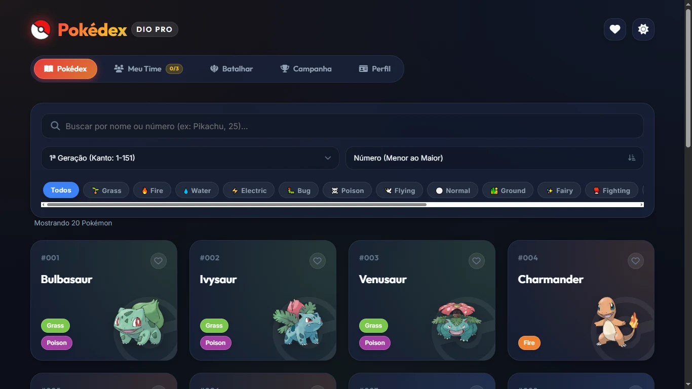
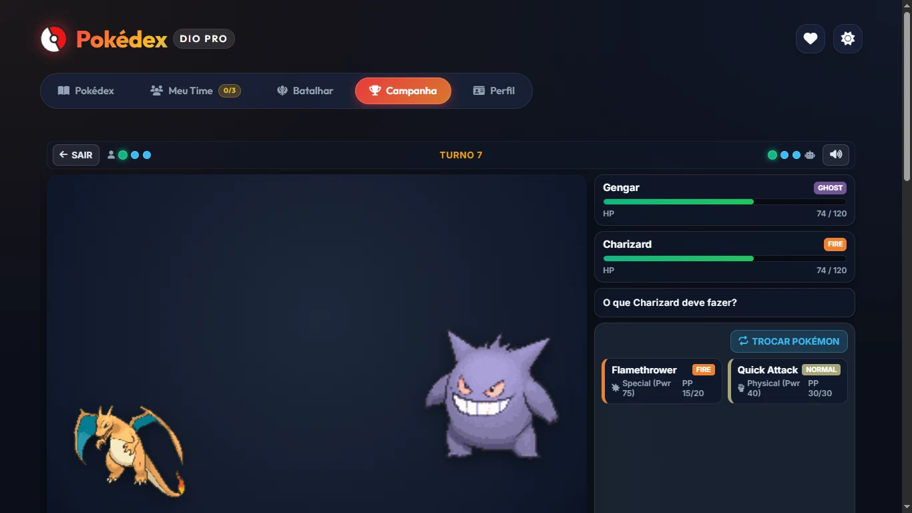
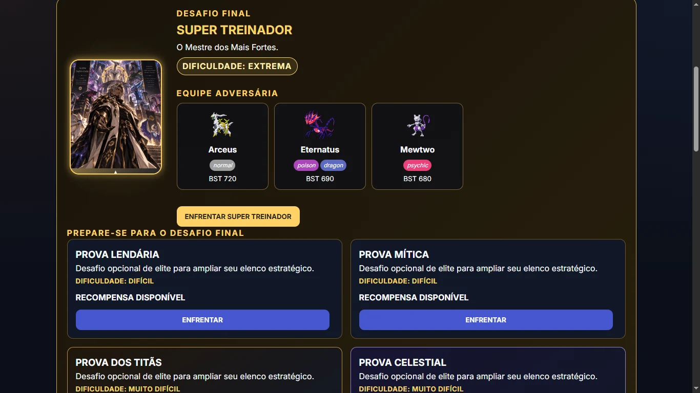
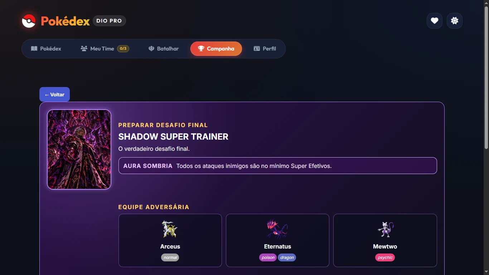

# Pokédex Pro + Pokémon Battle Arena

[](tests)
[](docs/battle-architecture.md)
[](assets/js)
[](assets/js/presentation/sound-fx-player.js)
[](docs/PBA_016_PERFORMANCE_ACCESSIBILITY_AUDIT.md)
[](LICENSE)

> Uma plataforma web de Pokédex moderna e **Game Engine de batalha por turnos 3×3** com **SMART AI tática**, **Campanha com 18 Mestres de Tipo**, síntese de som procedural em runtime e suíte rigorosa de **575 testes automatizados**.

---

### 🎮 [Abrir Demonstração ao Vivo no GitHub Pages](https://spiritstonesrafa-ux.github.io/js-developer-pokedex/)

---

> [!NOTE]
> ### 💡 Destaque para Recrutadores e Avaliadores Técnicos
> O projeto teve origem no desafio acadêmico de Pokédex da **Digital Innovation One (DIO)**, mas foi inteiramente refatorado e expandido para uma **aplicação complexa de engenharia de software sem frameworks**:
> 1. **Game Engine Determinística ≠ Presentation Engine:** O motor de combate calcula dano, tipos, turnos e estados serializáveis de forma puramente lógica e desacoplada do DOM. A interface consome streams de eventos sem jamais alterar HP/PP diretamente.
> 2. **SMART AI Tática:** IA adversária que calcula dano esperado, precisão ponderada, fraquezas duplas (4x), resistências, imunidades (0x), bônus STAB, trocas voluntárias e substituições inteligentes — com RNG injetável e zero trapaça.
> 3. **Engenharia de Performance e Acessibilidade:** Payload de cards de campanha reduzido em 65,7% com entrega de thumbnails WebP, navegação completa por teclado, suporte nativo a `prefers-reduced-motion` e contratos WAI-ARIA.
> 4. **Cultura de Testes:** **575 testes automatizados** executados via `npm test` com o test runner nativo do Node.js (`node:test`) em ~7 segundos.

---

## ⚡ Guia Rápido (Executando e Testando)

```bash
# 1. Clone o repositório
git clone https://github.com/spiritstonesrafa-ux/js-developer-pokedex.git
cd js-developer-pokedex

# 2. Execute a suíte com 575 testes automatizados
npm test

# 3. Testes específicos por subsistema
npm run test:ai        # Validação dos 43 gates da IA Tática
npm run test:engine    # Validação do Motor Determinístico de Batalha
npm run test:campaign  # Validação do Sistema de Campanha e 18 Mestres
npm run test:vfx       # Validação dos 40 gates de Efeitos Visuais
```
*Para jogar localmente, basta abrir o `index.html` em qualquer navegador moderno.*

---

## Destaques do Projeto

- **Pokédex Interativa:** Consumo REST da PokéAPI, busca, filtros combinados por tipo e geração, ordenação, favoritos persistentes em LocalStorage e áudio oficial (cries).
- **Team Builder:** Montagem e reordenação de equipes de até 3 Pokémon com validação contra duplicatas e definição de líder.
- **Battle Arena 3×3:** Combate por turnos com até 4 golpes por Pokémon, cálculo oficial de STAB e efetividade de tipos, PP canônico, trocas voluntárias e substituição obrigatória pós-nocaute.
- **Pipeline de Apresentação Modular:** Animações CSS coordenadas, VFX elementais para todos os 18 tipos, câmera dinâmica de impacto e síntese sonora procedural com Web Audio API.
- **Campanha — Circuito dos 18 Mestres & Endgame:** Draft inicial, progressão persistente, insígnias, chefes com retratos originais, provas lendárias e o desafio final contra o **Shadow Super Trainer** com até 37 Pokémon disponíveis na mesma Battle Engine.

## Screenshots

| Pokédex Pro | Battle Arena 3×3 |
| :---: | :---: |
|  |  |
| **Campaign — 18 Mestres** | **Endgame & Shadow Final Stand** |
|  |  |

## Da Pokédex Simples à Battle Arena Completa

```text
Desafio DIO de Pokédex
  → Pokédex Pro com filtros, áudio e favoritos
  → Team Builder com persistência e validações
  → Battle Engine determinística (cálculo de dano, tipos e turnos)
  → Batalhas 3×3 e IA Tática com tomada de decisão determinística
  → Presentation Engine: VFX para 18 tipos, áudio procedural e câmera
  → Campanha com 18 Mestres, Endgame e Shadow Final Stand
  → Hardening contínuo de A11y, Performance WebP e 575 Testes
```

## Funcionalidades principais

### Pokédex e Team Builder

A Pokédex consome dados públicos da PokéAPI, oferece filtros por tipo e geração, ordenação, favoritos, detalhes de atributos e evolução. O Team Builder mantém a equipe no navegador, impede duplicatas, permite reordenação acessível e define o líder do combate.

### Battle Arena

Quick Battle usa equipes 3×3, até quatro golpes ofensivos por Pokémon, PP, STAB, efetividade de tipos, trocas voluntárias e substituições obrigatórias após nocaute. A SMART AI avalia dano esperado, precisão, STAB, imunidades, matchups e reservas válidas.

A apresentação é orientada por eventos: a regra de combate produz eventos estruturados, e uma camada independente coordena UI, sprites, VFX, áudio procedural e câmera. HP e PP permanecem canônicos através das trocas; a interface não recalcula dano nem altera o estado de combate.

### Campaign — Circuito dos Mestres

O modo Campaign é uma jornada persistente: draft inicial, elenco que cresce por recompensas, insígnias e **18 Mestres**, um para cada tipo Pokémon. Cada Mestre possui apresentação com arte de treinador criada especificamente para esta experiência de portfólio.

Depois do circuito, o endgame inclui as provas **Legendary**, **Mythical**, **Titans** e **Celestial**, o **Super Trainer**, uma falsa conclusão e o verdadeiro desafio contra o **Shadow Super Trainer**. O confronto final aplica Shadow Aura e culmina no **Shadow Final Stand**, seguido pelo True Ending.

O Shadow Final Stand reutiliza a mesma arquitetura de sessão e Battle Engine — não existe um segundo motor de batalha. Ele combina elenco permanente e reforços temporários das provas, chegando ao estado validado de até 37 Pokémon disponíveis contra um trio Shadow fixo. A batalha também inclui uma tema de boss procedural criado em runtime com Web Audio API; não há asset musical externo para esse tema.

## Engenharia em destaque

- **Battle Engine determinística:** regras, dano, turnos e estado serializável são independentes de DOM, áudio e rede.
- **Game Engine ≠ Presentation Engine:** uma timeline de apresentação consome eventos sem interferir na matemática do combate.
- **SMART AI e aleatoriedade injetável:** decisões táticas reproduzíveis em teste, com RNG isolado do motor e da IA.
- **Arquitetura compartilhada:** Quick Battle e Campaign reutilizam Battle Session, Engine e Presentation Engine.
- **Apresentação modular:** animações, VFX, Web Audio procedural e câmera são adaptadores irmãos sob uma composição única.
- **Hardening baseado em evidência:** thumbnails WebP, carregamento adiado, regressão automatizada e validações de acessibilidade.

## Arquitetura

```text
Data / API
  ↓
Domain Model
  ↓
Battle Session
  ↓
Game Engine
  ↓
Presentation Engine
  ↓
Adapters
  ↓
UI
```

A regra central é **Game Engine ≠ Presentation Engine**. O Battle Engine resolve a batalha e emite eventos; a Presentation Engine os agenda para os adaptadores de UI, animação, VFX, áudio e câmera. A Campaign fornece contexto e equipes para a mesma sessão de batalha, sem duplicar o motor.

Para detalhes, consulte a [arquitetura da Battle Arena](docs/battle-architecture.md).

## Performance e acessibilidade

A entrega de arte dos cards da Campaign foi medida em cenário controlado: o Campaign Home passou de **7.558.275 bytes** para **2.589.922 bytes** de transferência de assets de treinador, redução de **65,7%** naquele cenário. Foram adicionadas 18 thumbnails WebP para os cards dos Mestres; retratos PNG de alta resolução permanecem nas superfícies maiores de preparação, recompensa e batalha. Para os cards visíveis de Aster e Kael, a amostra caiu de 4.994.905 para 26.552 bytes (99,5%) — isso descreve a entrega desses assets, não uma alegação de velocidade global do site.

Fluxos críticos foram validados em 360×700, 390×844, 412×915 e 1366×768, sem overflow horizontal. A experiência inclui foco visível, controles semânticos, estados `aria-pressed`, barras de HP acessíveis, gerenciamento de foco em diálogos, alvos mobile de toque, verificação em zoom de 200% e suporte a `prefers-reduced-motion`. A navegação por teclado dos fluxos de perfil e troca foi homologada em navegador real. Uma avaliação com leitor de tela real ainda não foi realizada.

A evidência completa está em [Performance & Accessibility Audit](docs/PBA_016_PERFORMANCE_ACCESSIBILITY_AUDIT.md).

## Testes automatizados

Na baseline de release candidate v1.0, a suíte contém **575 testes aprovados**, **0 falhas**, **0 cancelados**, em **21 suítes**. A contagem pode evoluir; os testes cobrem Battle Engine, Type Chart, sistema de golpes, trocas, AI, Presentation Engine, VFX/áudio/câmera, Battle Session, Campaign e regressões estruturais de acessibilidade e performance.

No PowerShell, execute a suíte completa com:

```powershell
node --test (Get-ChildItem -Recurse -File tests -Filter *.test.js | ForEach-Object { $_.FullName })
```

Exemplo de recorte relevante:

```powershell
node --test tests/ui/battle-ui.test.js tests/campaign/trainer-avatar.test.js
```

## Tecnologias

- JavaScript ES6+, HTML5 semântico e CSS moderno
- PokéAPI para dados, sprites e cries onde aplicável
- Web Audio API para efeitos, música de batalha e tema Shadow procedural
- Fetch API e LocalStorage
- CSS Grid, Flexbox, animações e `prefers-reduced-motion`

## Executando localmente

```bash
git clone https://github.com/spiritstonesrafa-ux/js-developer-pokedex.git
cd js-developer-pokedex
```

Abra `index.html` em um navegador moderno ou sirva a pasta com um servidor HTTP simples. A aplicação requer recursos de navegadores modernos, incluindo ES6+, Fetch, LocalStorage, CSS Grid/Flexbox e Web Audio API.

## Documentação técnica

- [Arquitetura da Battle Arena](docs/battle-architecture.md)
- [Campaign Mode](docs/CAMPAIGN_MODE.md)
- [Performance & Accessibility Audit](docs/PBA_016_PERFORMANCE_ACCESSIBILITY_AUDIT.md)
- [Portfolio & Release Audit](docs/PBA_017_PORTFOLIO_RELEASE_AUDIT.md)

## Licença

O código-fonte original deste projeto é disponibilizado sob a [licença MIT](LICENSE). A MIT aplica-se somente ao código-fonte original do projeto. Ela **não** abrange Pokémon, personagens, nomes, marcas, sprites, cries, dados, materiais da PokéAPI, artes personalizadas dos treinadores ou outros assets visuais/de terceiros, salvo indicação explícita em contrário.
## Aviso sobre propriedade intelectual

Este é um projeto educacional e de portfólio, não comercial e sem afiliação ou endosso da Nintendo, The Pokémon Company ou Game Freak. Nomes, personagens e assets relacionados a Pokémon pertencem aos respectivos titulares. Dados e assets de Pokémon são consumidos da PokéAPI quando aplicável. A Campaign inclui arte personalizada de treinadores criada especificamente para a apresentação deste projeto.