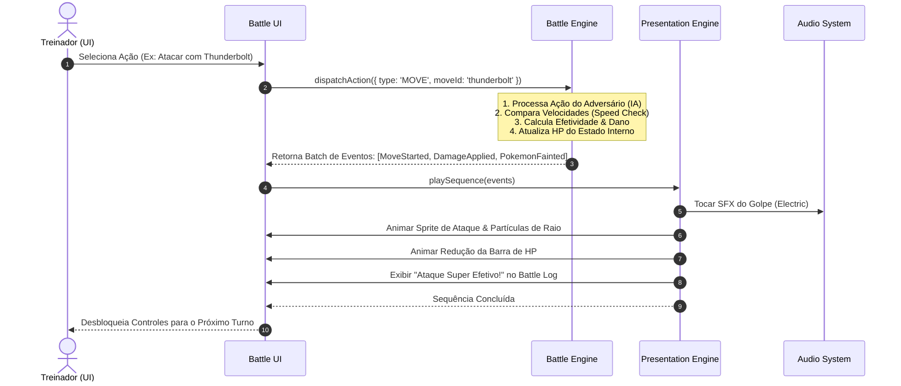

# ⚔️ Arquitetura Técnica: Pokémon Battle Arena

Documento de especificação arquitetural para a evolução do projeto **Pokédex Pro** (desafio DIO) para a plataforma integrada **Pokédex Pro + Pokémon Battle Arena**.

---

## 1. Objetivo Geral

O objetivo deste projeto é expandir a Pokédex existente — construída com **HTML5**, **CSS3** e **JavaScript Vanilla** consumindo a **PokéAPI REST** — transformando-a em uma aplicação de portfólio robusta e completa, contendo:

1. **Pokédex Completa** (preservada e otimizada);
2. **Team Builder** (gerenciamento e persistência de equipes táticas de 1 a 6 Pokémon);
3. **Pokémon Battle Arena** (simulador de batalhas por turnos 1x1 e 3x3 contra inteligência artificial, cálculo de dano fiel às mecânicas clássicas, efetividade de tipos, sistema de movimentos, animações dinâmicas e efeitos visuais/sonoros).

A evolução ocorre de maneira **incremental e orientada a fases (PBA-001 a PBA-018)**, garantindo que o código existente nunca seja quebrado e que novas funcionalidades sejam introduzidas com separação estrita de responsabilidades.

---

## 2. Princípios Arquiteturais Fundamentais

1. **Preservação da Pokédex Atual**: Nenhuma refatoração deve introduzir regressões na listagem, busca, paginação, filtros, modal ou reprodução de áudio já existentes.
2. **Regra de Ouro: Game Engine ≠ Presentation Engine**: A lógica matemática e as regras de combate nunca dependem de elementos visuais, classes CSS, APIs de áudio ou manipulação de DOM.
3. **Pureza do Modelo de Domínio**: Entidades do jogo (`Pokemon`, `Move`, `Team`, `Trainer`) contêm dados e regras de negócio puras, operando independentemente de bibliotecas externas e da PokéAPI.
4. **Isolamento de Estado (Game State)**: O estado da batalha é serializável, determinístico e desacoplado da interface gráfica.
5. **Zero Dependências Pesadas / Vanilla First**: O projeto demonstra proficiência técnica em JavaScript Vanilla, arquitetura limpa, manipulação avançada de DOM e CSS moderno.
6. **Acessibilidade e Desempenho**: Suporte futuro a `prefers-reduced-motion`, controle de volume independente, contrastes adequados e carregamento sob demanda (*lazy loading*).

---

## 3. Separação em Camadas

A arquitetura do projeto adota uma estrutura em camadas unidirecional:

```text
       ┌───────────────────────────────┐
       │          Data / API           │  (poke-api.js / PokemonRepository)
       └──────────────┬────────────────┘
                      │ DTOs / JSON transformados
                      ▼
       ┌───────────────────────────────┐
       │         Domain Model          │  (Pokemon, Move, Team, Trainer)
       └──────────────┬────────────────┘
                      │ Entidades e atributos puros
                      ▼
       ┌───────────────────────────────┐
       │          Game Engine          │  (BattleEngine, TurnManager, DamageCalc)
       └──────────────┬────────────────┘
                      │ Eventos de Batalha (Action Events)
                      ▼
       ┌───────────────────────────────┐
       │      Presentation Engine      │  (AnimationQueue, AudioSystem, VFX)
       └──────────────┬────────────────┘
                      │ Atualizações Visuais / Áudio
                      ▼
       ┌───────────────────────────────┐
       │           UI / DOM            │  (Telas, Painéis, Healthbars, Modais)
       └───────────────────────────────┘
```

---

## 4. O Paradigma "Game Engine ≠ Presentation Engine"

Esta é a diretriz mais crítica para o desenvolvimento da Battle Arena.

### Battle Engine (Lógica Pura)
Responsável por:
- Determinar a iniciativa de ataque com base em *Speed* e prioridade do movimento;
- Calcular precisão (*accuracy*) e taxa de acerto crítico (*critical hit*);
- Calcular o dano real através da fórmula padrão considerando ataque, defesa, STAB (*Same-Type Attack Bonus*) e tabela de tipos;
- Gerenciar a fila de turnos e status de combate (*fainted*, trocas, turnos decorridos);
- Executar a tomada de decisão da IA adversária;
- Emitir uma sequência determinística de **Eventos de Ação** (*Action Events*).

### Presentation Engine (Efeitos, Som e Visuais)
Responsável por:
- Consumir os *Action Events* emitidos pela Battle Engine de forma assíncrona;
- Reproduzir animações de sprites (entrada, ataque corporal, projéteis, impacto, recuo);
- Sincronizar efeitos sonoros (*cry* do Pokémon, som de golpe, impacto, vitória/derrota);
- Controlar animações de barras de HP e feedback numérico de dano;
- Disparar efeitos visuais (tremores de tela / *shake*, flashes, partículas de fogo, água, eletricidade);
- Notificar a UI quando a apresentação do turno foi finalizada, liberando o próximo comando do jogador.

> **Importante**: Se a camada de apresentação for desativada (por exemplo, em testes automatizados ou em modo de simulação rápida), a batalha pode ser executada instantaneamente em milissegundos sem qualquer erro ou dependência gráfica.

---

## 5. Fluxo Futuro de uma Batalha



---

## 6. Responsabilidades dos Módulos Detalhados

| Módulo | Camada | Responsabilidade Técnica |
| :--- | :--- | :--- |
| `poke-api.js` | Data | Requisições HTTP com Fetch API para a PokéAPI REST, conversão de payloads brutos em instâncias do modelo. |
| `PokemonRepository` | Data | Gerenciamento de cache em memória e LocalStorage, reduzindo chamadas repetidas à rede. |
| `Pokemon` | Domain | Representação de atributos base (*hp, attack, defense, spAttack, spDefense, speed*), tipos, habilidades e dados de espécie. |
| `Move` | Domain | Representação de golpes: tipo, categoria (*physical, special, status*), poder (*power*), precisão (*accuracy*) e PP. |
| `TypeChart` | Domain | Matriz bidimensional de relações elementais (fraquezas 2x, resistências 0.5x e imunidades 0x). |
| `Team` | Domain | Estrutura de equipe (1 a 6 integrantes), validações de tamanho, Pokémon ativo e reservas. |
| `BattleEngine` | Engine | Controlador central da lógica de batalha, turnos, condições de vitória/derrota. |
| `DamageCalculator` | Engine | Implementação matemática da fórmula de dano dos jogos da franquia, aplicando modificadores. |
| `BattleAI` | Engine | Heurística adversária (seleção de movimentos por efetividade, trocas inteligentes). |
| `BattlePresentation` | Presentation | Orquestrador da fila de animações e transições entre estados gráficos. |
| `AudioSystem` | Presentation | Gerenciador de canais de áudio com canais separados (Música de Fundo, SFX de Ataque, Cry, Interface) e controle de volume. |
| `AnimationSystem` | Presentation | Execução de animações CSS/Canvas de movimentos de sprites e partículas elementais. |
| `BattleUI` | UI | Painéis de comando, caixas de diálogo (*Battle Log*), seletores de golpe e barras de status. |

---

## 7. Decisões Técnicas das Fases

### Fase PBA-001 (Foundation)
1. **Manutenção dos Scripts Globais Sem Quebra**: Os arquivos existentes (`pokemon-model.js`, `poke-api.js`, `main.js`) foram mantidos compatíveis com carregamento direto sem empacotadores, viabilizando execução direta no GitHub Pages e no protocolo local `file://`.
2. **Navegação Não-Destrutiva**: Introdução das abas de navegação no cabeçalho (`Pokédex`, `Meu Time`, `Batalhar`).
3. **Estrutura de Armazenamento com Namespaces**: Preservação de `pokedex_favorites` e `pokedex_theme`.

### Fase PBA-002 (Team Builder)
1. **Modelo do Time**: Capacidade máxima de 3 Pokémon (`TEAM_MAX_SIZE = 3`), proibição estrita de duplicatas (`DUPLICATE_POKEMON = FORBIDDEN`) e preservação da ordem (`ORDER_MATTERS = YES`), onde o **Slot 1** define o Líder (*Lead*) que iniciará futuras batalhas.
2. **Persistência Estruturada (`team.current`)**: Armazenamento serializado contendo apenas IDs essenciais (`{ "version": 1, "pokemonIds": [25, 6, 94] }`), com sanitização automática contra JSON corrompido, IDs inválidos ou arrays fora dos limites.
3. **Desacoplamento Modular**: Separação em três componentes especializados em `assets/js/team/`:
   - `TeamStore`: Manipulação e validação do `localStorage`;
   - `TeamManager`: Regras de negócio, reordenação e emissão de eventos;
   - `TeamUI`: Renderização dos slots (ocupados, vazios e erro), feedback dinâmico e botões de atalho.
4. **Sincronização em Tempo Real**: Atualização instantânea dos cards da Pokédex (`✓ No time`), botões do modal e contadores do cabeçalho sem necessidade de recarregamento.

### Fase PBA-003 (Battle Engine v1)
1. **Núcleo Matemático Isolado e Desacoplado**:
   - Criação dos módulos em `assets/js/battle/`:
     - `battle-constants.js`: Estados (`BATTLE_STATUS`), eventos (`BATTLE_EVENTS`), ações (`BATTLE_ACTIONS`) e configurações (`BATTLE_CONFIG`);
     - `damage-calculator.js`: Cálculo de dano determinístico baseado estritamente em Ataque e Defesa;
     - `turn-manager.js`: Gerenciador de iniciativa baseado em Velocidade (*Speed*);
     - `battle-engine.js`: Criação do estado de combate, normalização de combatentes, validações contra estados inválidos/NaN, resolução de turnos e emissão de eventos ordenados.
2. **Modelo do Combatente Normalizado**:
   - Estrutura pura e independente da PokéAPI ou do DOM:
     ```json
     {
       "id": 4,
       "name": "charmander",
       "maxHp": 39,
       "currentHp": 39,
       "attack": 52,
       "defense": 43,
       "speed": 65
     }
     ```
   - Validação estrita: rejeita `id <= 0`, `name` vazio, `hp <= 0`, `attack <= 0`, `defense <= 0`, `speed < 0`, `NaN`, `Infinity`, `null` ou `undefined`.
3. **Estado de Batalha v1 (Battle State)**:
   - Serializável, determinístico e imutável nas entradas:
     ```json
     {
       "version": 1,
       "status": "IN_PROGRESS",
       "turn": 1,
       "player": { "id": 4, "name": "charmander", "maxHp": 39, "currentHp": 39, "attack": 52, "defense": 43, "speed": 65 },
       "enemy": { "id": 1, "name": "bulbasaur", "maxHp": 45, "currentHp": 45, "attack": 49, "defense": 49, "speed": 45 },
       "winner": null
     }
     ```
   - Estados: `READY`, `IN_PROGRESS`, `PLAYER_WIN`, `ENEMY_WIN`.
4. **Fórmula de Dano da PBA-003**:
   - Inspirada na estrutura clássica da franquia, porém estritamente determinística (sem randomização, sem fraquezas/resistências de tipo e sem acertos críticos):
     ```text
     SIMULATION_LEVEL = 50
     BASIC_ATTACK_POWER = 40
     
     damage = floor(((((2 * SIMULATION_LEVEL / 5) + 2) * BASIC_ATTACK_POWER * attack / defense) / 50) + 2)
     damage = max(1, damage)
     ```
   - Piso de HP: o dano recebido nunca deixa o combatente com HP negativo (`currentHp = max(0, previousHp - damage)`).
5. **Regra de Iniciativa e Desempate**:
   - O combatente com maior *Speed* atua primeiro;
   - Em caso de empate de *Speed*, aplica-se a regra determinística da fase: `PLAYER_FIRST_ON_SPEED_TIE = true` (jogador sempre atua primeiro no desempate da PBA-003).
6. **Fluxo do Turno e Suspensão de Contra-Ataque**:
   - Turno inicia -> Ordem definida -> 1º Pokémon ataca -> Dano aplicado -> Verificação de nocaute (`currentHp === 0`).
   - Se o primeiro combatente nocautear o alvo: o combate encerra imediatamente (`POKEMON_FAINTED` e `BATTLE_ENDED`), status atualizado para vitória/derrota, e o Pokémon derrotado **NÃO contra-ataca**.
   - Bloqueio pós-combate: tentativas de invocar `resolveTurn()` em batalha já encerrada são rejeitadas com erro controlado, sem corromper o estado.
7. **Barramento de Eventos Estruturados**:
   - Eventos emitidos em sequência ordenada:
     - `BATTLE_STARTED`
     - `TURN_STARTED` (com número do turno)
     - `ACTION_STARTED` (com ator e ação executada)
     - `DAMAGE_APPLIED` (com fonte, alvo, dano numérico, HP anterior e HP resultante)
     - `POKEMON_FAINTED` (com alvo derrotado)
     - `BATTLE_ENDED` (com vencedor e causa)
8. **Critérios de Isolamento Absoluto**:
   - `BATTLE_ENGINE_DOM_DEPENDENCIES = 0` (nenhum `document.*` ou `window.*` de interface);
   - `BATTLE_ENGINE_FETCH_CALLS = 0` (sem chamadas à PokéAPI durante a simulação);
   - `BATTLE_ENGINE_LOCALSTORAGE_DEPENDENCIES = 0` (sem persistência acoplada);
   - `BATTLE_ENGINE_AUDIO_DEPENDENCIES = 0` (sem dependências sonoras);
   - `INPUT_MUTATION = NONE` (entradas são clonadas e imutáveis).

### Fase PBA-004 (Type System)
1. **Catálogo Canônico dos 18 Tipos**:
   - `POKEMON_TYPES`: `normal`, `fire`, `water`, `electric`, `grass`, `ice`, `fighting`, `poison`, `ground`, `flying`, `psychic`, `bug`, `rock`, `ghost`, `dragon`, `dark`, `steel`, `fairy`.
   - Normalização rigorosa de casing e espaçamento (`" FIRE "` -> `"fire"`), com rejeição estrita de tipos inválidos, vazios ou desconhecidos (`shadow`, `unknown`, etc.).
2. **Matriz Completa de Efetividade (Type Chart)**:
   - Implementação em `assets/js/battle/type-chart.js` cobrindo todas as 324 relações elementais ($18 \times 18$) das gerações modernas (Gen 6+ com tipo Fairy).
   - Multiplicadores para defensores single-type: `0` (imune), `0.5` (resistido), `1` (neutro), `2` (super efetivo).
3. **Cálculo e Combinações de Dual-Type (`TypeEffectiveness`)**:
   - Módulo puro `assets/js/battle/type-effectiveness.js` calculando a efetividade combinada:
     $$\text{multiplier} = \text{chart}[A][D_1] \times \text{chart}[A][D_2]$$
   - Suporte completo aos multiplicadores resultantes: `0`, `0.25`, `0.5`, `1`, `2` e `4`.
   - Prevalência estrita de imunidade: se qualquer relação elemental for $0$, o multiplicador final é necessariamente $0$ ($x \times 0 = 0$).
   - Validações: rejeita defensores com tipos duplicados (`['water', 'water']`), mais de 2 tipos ou listas vazias.
   - Classificação estruturada: `IMMUNE` (0), `RESISTED` (< 1), `NEUTRAL` (1), `SUPER_EFFECTIVE` (> 1).
4. **Combatant Model v2**:
   - Normalização de combatentes com tipos canônicos validados:
     ```json
     {
       "id": 4,
       "name": "charmander",
       "types": ["fire"],
       "maxHp": 39,
       "currentHp": 39,
       "attack": 52,
       "defense": 43,
       "speed": 65
     }
     ```
5. **Integração com a Calculadora de Dano (`DamageCalculator`)**:
   - Separação modular de responsabilidades:
     - `calculateBaseDamage(attack, defense, power, level)`: gera o dano base puro ($\ge 1$).
     - `applyModifier(baseDamage, multiplier)`: aplica a efetividade com piso em zero para imunidade e piso mínimo de $1$ para não-imunidades:
       ```javascript
       if (multiplier === 0) return 0;
       return Math.max(1, Math.floor(baseDamage * multiplier));
       ```
6. **Barramento de Eventos Atualizado**:
   - Inclusão do evento `TYPE_EFFECTIVENESS_RESOLVED` disparado imediatamente antes de `DAMAGE_APPLIED`:
     ```json
     {
       "type": "TYPE_EFFECTIVENESS_RESOLVED",
       "source": "player",
       "target": "enemy",
       "attackType": "fire",
       "defenderTypes": ["grass", "poison"],
       "multiplier": 2,
       "classification": "SUPER_EFFECTIVE"
     }
     ```
   - Ordem estrita do ciclo de ação: `ACTION_STARTED` -> `TYPE_EFFECTIVENESS_RESOLVED` -> `DAMAGE_APPLIED` (-> `POKEMON_FAINTED` -> `BATTLE_ENDED`).
7. **Ponte Temporária do `BASIC_ATTACK`**:
   - Enquanto o catálogo de movimentos (*Move System*) não é introduzido na Fase PBA-005, o `BASIC_ATTACK` adota temporariamente o tipo primário do atacante (`attacker.types[0]`).
   - STAB (*Same-Type Attack Bonus*) **não foi implementado**, permanecendo reservado para fases futuras.

---

## 8. Decisões Explicitamente Adiadas

### Fase PBA-005 (Move System)
1. **Modelo Canônico de Golpe (`MoveModel`)**:
   - Estrutura imutável normalizada com validação rigorosa (`assets/js/battle/move-model.js`):
     ```json
     {
       "id": 85,
       "name": "thunderbolt",
       "type": "electric",
       "power": 90,
       "accuracy": 100,
       "pp": 15,
       "damageClass": "special"
     }
     ```
   - Categoria de dano (`damageClass`): `physical` e `special`.
   - Golpes da categoria `status` (ex: *Growl*, *Thunder Wave*) são reconhecidos pelo modelo, porém rejeitados com erro controlado (`UNSUPPORTED_IN_PBA_005`), sem conversão para danos fictícios.
   - Suporte a golpes *Always-Hit* (com `accuracy: null`), dispensando checagem de acurácia.
2. **Combatant Model v3**:
   - Expansão dos atributos de combate para incluir ataque/defesa especial e catálogo de movimentos:
     ```json
     {
       "id": 6,
       "name": "charizard",
       "types": ["fire", "flying"],
       "maxHp": 78,
       "currentHp": 78,
       "attack": 84,
       "defense": 78,
       "specialAttack": 109,
       "specialDefense": 85,
       "speed": 100,
       "moves": [
         { "id": 53, "name": "flamethrower", "type": "fire", "power": 90, "accuracy": 100, "maxPp": 15, "currentPp": 15, "damageClass": "special" },
         { "id": 337, "name": "dragon-claw", "type": "dragon", "power": 80, "accuracy": 100, "maxPp": 15, "currentPp": 15, "damageClass": "physical" },
         { "id": 10, "name": "scratch", "type": "normal", "power": 40, "accuracy": 100, "maxPp": 35, "currentPp": 35, "damageClass": "physical" }
       ]
     }
     ```
   - Regras de loadout: mínimo de 1 golpe, máximo de 4 golpes (`MOVE_LOADOUT_MIN = 1`, `MOVE_LOADOUT_MAX = 4`), sem duplicatas por ID ou nome.
3. **Divisão Físico vs Especial e Seleção de Atributos**:
   - Golpes Físicos: utilizam `attacker.attack` contra `defender.defense`.
   - Golpes Especiais: utilizam `attacker.specialAttack` contra `defender.specialDefense`.
   - Independência cruzada comprovada: alterar `specialAttack` não altera o dano físico, e alterar `attack` não altera o dano especial.
4. **Move Power & Desativação do Tipo Primário Temporário**:
   - O poder do ataque agora é dinâmico e fornecido pelo golpe selecionado (`move.power`).
   - O tipo da ação agora é derivado exclusivamente do golpe (`attackType = move.type`).
   - A regra de ponte temporária da PBA-004 (`BASIC_ATTACK_PRIMARY_TYPE_BRIDGE_ACTIVE`) foi desativada no caminho ativo do Battle Engine (`NO`).
5. **Sistema de PP (Power Points)**:
   - Estado runtime (`currentPp`) isolado do modelo estático (`maxPp`).
   - Consumo de 1 PP ocorre no início da execução da ação, tanto em acertos (*hit*) quanto em erros (*miss*).
   - Bloqueio estrito de golpes com `currentPp <= 0` (`ACTION_REJECTED`).
   - Preservação em nocaute: se o primeiro atacante nocautear o adversário, o golpe do defensor **não é executado e seu PP permanece inalterado**.
6. **Resolução Determinística de Precisão (Accuracy)**:
   - A Battle Engine não invoca `Math.random()`.
   - Ações externas recebem opcionalmente `accuracyRoll` ($1 \le \text{roll} \le 100$).
   - Condição de acerto: $\text{roll} \le \text{move.accuracy}$ (ou golpe *Always-Hit*).
   - Em caso de *miss*: emite evento `MOVE_MISSED`, consome PP, não emite `DAMAGE_APPLIED` e mantém o HP do defensor intacto.
7. **STAB (Same-Type Attack Bonus) e Pipeline de Dano v2**:
   - Multiplicador de $1.5\times$ caso `attacker.types.includes(move.type)`, e $1.0\times$ caso contrário.
   - Prevalência estrita de imunidade: se `typeMultiplier === 0`, o dano final é impreterivelmente $0$ (STAB jamais supera imunidade).
   - Pipeline de cálculo:
     $$\text{baseDamage} = \text{calculateBaseDamage}(\text{attackStat}, \text{defenseStat}, \text{power}, \text{level})$$
     $$\text{finalDamage} = \text{applyModifier}(\text{baseDamage}, \text{typeMultiplier}, \text{stabMultiplier})$$
     $$\text{danoModificado} = \lfloor \text{baseDamage} \times \text{stabMultiplier} \times \text{typeMultiplier} \rfloor$$
     $$\text{finalDamage} = \begin{cases} 0 & \text{se } \text{typeMultiplier} = 0 \\ \max(1, \text{danoModificado}) & \text{se } \text{typeMultiplier} > 0 \end{cases}$$
8. **Fronteira de Dados e Integração com a PokéAPI**:
   - `pokeApi.getMoveDetail(moveOrIdOrUrl)` implementado em `assets/js/poke-api.js` com cache em memória (`Map`) para evitar requisições repetidas.
   - A Battle Engine permanece 100% isolada de chamadas `fetch()`.
9. **Barramento de Eventos do Move System**:
   - Fluxo completo em caso de HIT:
     $$\text{TURN\_STARTED} \to \text{ACTION\_STARTED} \to \text{MOVE\_SELECTED} \to \text{MOVE\_USED} \to \text{PP\_CHANGED} \to \text{STAB\_RESOLVED} \to \text{TYPE\_EFFECTIVENESS\_RESOLVED} \to \text{DAMAGE\_APPLIED}$$
     (seguido de $\text{POKEMON\_FAINTED} \to \text{BATTLE\_ENDED}$ em caso de nocaute).
   - Fluxo em caso de MISS:
     $$\text{TURN\_STARTED} \to \text{ACTION\_STARTED} \to \text{MOVE\_SELECTED} \to \text{MOVE\_USED} \to \text{PP\_CHANGED} \to \text{MOVE\_MISSED}$$

---

## 8. Arquitetura da Batalha 3x3 e Sistema de Trocas (PBA-006)

A Fase PBA-006 evoluiu o motor matemático de combate de 1x1 para confrontos completos de equipes 3x3 (**3 Pokémon contra 3 Pokémon**), introduzindo:

### 8.1 Battle Team Model e Validação Estrita
- **Tamanho Fixo**: Exatamente 3 integrantes por lado (`TEAM_SIZE = 3`). Batalhas com 0, 1, 2 ou 4+ Pokémon são rejeitadas com erro explícito (`INVALID_TEAM_SIZE`).
- **Unicidade de Espécies**: Proibição de Pokémon duplicados na mesma equipe pelo `id`.
- **Validação Individual**: Cada combatente continua sendo validado pelas regras do *Combatant Model v3* (HP, stats, loadout de 1 a 4 moves válidos).
- **Líder Inicial**: O Pokémon fornecido no índice 0 (Slot 1 do Team Builder) é preservado rigorosamente como o combatente ativo inicial (`activeIndex: 0`).

### 8.2 Separação de Responsabilidade: Team Builder vs Battle State
$$\text{team.current (LocalStorage)} \neq \text{Battle Runtime State}$$
O Team Builder armazena apenas a seleção do usuário (`pokemonIds`). A Battle Engine cria instâncias runtime totalmente desacopladas, com clones profundos independentes para `currentHp`, `currentPp` e flags de estado. A persistência do time nunca é alterada pelo combate.

### 8.3 Battle State v2
Estrutura determinística, serializável e livre de DOM:
```json
{
  "version": 2,
  "status": "IN_PROGRESS",
  "turn": 1,
  "player": {
    "activeIndex": 0,
    "team": [
      { "id": 4, "name": "charmander", "currentHp": 39, "moves": [...] },
      { "id": 25, "name": "pikachu", "currentHp": 35, "moves": [...] },
      { "id": 7, "name": "squirtle", "currentHp": 44, "moves": [...] }
    ]
  },
  "enemy": {
    "activeIndex": 0,
    "team": [
      { "id": 1, "name": "bulbasaur", "currentHp": 45, "moves": [...] },
      { "id": 74, "name": "geodude", "currentHp": 40, "moves": [...] },
      { "id": 130, "name": "gyarados", "currentHp": 95, "moves": [...] }
    ]
  },
  "winner": null
}
```

### 8.4 Pokémon Ativo vs Banco
- **Ativo**: Exatamente um Pokémon por lado (`state[side].activeIndex`). Apenas o ativo pode desferir golpes (`MOVE`), receber danos e consumir PP.
- **Banco**: Membros reservas (`activeIndex !== index`) não atacam, não recebem dano passivo e mantêm seu HP e PP estritamente intactos.

### 8.5 Prioridade da Troca Voluntária (Switch Priority)
$$\text{SWITCH} > \text{MOVE}$$
- Quando um treinador seleciona uma ação `SWITCH`, ela possui prioridade estrita de fase e ocorre **antes** de qualquer ataque `MOVE`, ignorando comparações de *Speed*.
- O novo Pokémon entra em campo imediatamente, tornando-se o novo alvo do golpe adversário no mesmo turno.
- Em caso de `SWITCH vs SWITCH`, ambas as trocas ocorrem antes de qualquer ação ofensiva, de forma determinística (Player depois Enemy), sem geração de dano.

### 8.6 Persistência Rigorosa de HP e PP no Banco
- Trocar de Pokémon não restaura HP nem recupera PP (`SWITCH_HP_PERSISTENCE = PASS`, `SWITCH_PP_PERSISTENCE = PASS`).
- Um Pokémon ferido ou com PP consumido que vai para o banco e posteriormente retorna ao campo preserva exatamente os mesmos valores.

### 8.7 Troca Forçada após Nocaute (Forced Replacement)
- Se o Pokémon ativo tem seu HP reduzido a 0 e a equipe ainda possui reservas com HP > 0:
  - A batalha **não termina**;
  - O estado transita para `AWAITING_REPLACEMENT`;
  - O motor emite o evento `REPLACEMENT_REQUIRED` contendo o ID do Pokémon nocauteado e os IDs disponíveis na reserva;
  - A troca forçada é resolvida explicitamente via `BattleEngine.resolveReplacement(state, replacementActions)`, desacoplando a decisão (feita futuramente por UI ou IA) do motor.
- O substituto entra com o status retornando para `IN_PROGRESS` e o turno é incrementado para o próximo ciclo de decisões. O Pokémon substituto **não** recebe o golpe que já havia sido concluído no turno anterior.

### 8.8 Derrota da Equipe e Fim da Batalha (Team Defeat)
- Um lado só é considerado derrotado quando **todos os 3 integrantes** estiverem com `currentHp === 0`.
- Nesse momento, são emitidos em sequência ordenada: `POKEMON_FAINTED`, `TEAM_DEFEATED` e `BATTLE_ENDED`.
- O status transita para `PLAYER_WIN` ou `ENEMY_WIN`.

### 8.9 Novos Eventos Estruturados
| Evento | Payload Semântico | Descrição |
|---|---|---|
| `SWITCH_STARTED` | `{ side, currentPokemonId, targetPokemonId }` | Início de uma troca voluntária |
| `POKEMON_SWITCHED` | `{ side, previousPokemonId, newPokemonId, reason }` | Troca concretizada (`reason: 'VOLUNTARY'` ou `'FAINT_REPLACEMENT'`) |
| `REPLACEMENT_REQUIRED` | `{ side, faintedPokemonId, availablePokemonIds }` | Notificação de necessidade de substituição obrigatória pós-nocaute |
| `TEAM_DEFEATED` | `{ side, teamSize }` | Notificação de que todos os 3 membros da equipe caíram |

---

## 9. Arquitetura da Inteligência Artificial: Battle AI (PBA-007)

A Fase PBA-007 implementou um subsistema dedicado e determinístico de Inteligência Artificial para controle do adversário (ou de qualquer combatente), mantendo a separação estrita:
$$\text{BATTLE ENGINE} \neq \text{BATTLE AI}$$
- **Battle Engine**: Autoridade absoluta das regras de combate (turnos, efetividade, cálculo e aplicação de dano, consumo de PP, transição de estados e eventos).
- **Battle AI**: Analisador estratégico do estado atual visível que escolhe uma ação legal (`MOVE` ou `SWITCH`) sem mutar o estado e sem executar efeitos colaterais.

### 9.1 Avaliador Puro de Combate (BattleEvaluator)
- **Função**: `BattleEvaluator.evaluateMove(attacker, defender, move)` e `BattleEvaluator.evaluateMatchup(candidate, opponent)`.
- **Dano Esperado (Expected Value)**:
  $$\text{expectedDamage} = \lfloor \text{damageIfHit} \times (\text{accuracy} / 100) \rfloor$$
  Para golpes *Always Hit* (`accuracy: null` ou `'ALWAYS_HIT'`), o fator de acurácia é $1.0$.
- **Classificação de Nocaute**: `wouldKo = damageIfHit >= defender.currentHp`.
- **Garantia de Imutabilidade**: Não altera HP, PP, flags ou listas do atacante e do defensor.

### 9.2 Estratégias Programáticas
1. **SIMPLE**:
   - Totalmente previsível e rígida;
   - Nunca realiza troca voluntária (`SIMPLE_AI_VOLUNTARY_SWITCH = NO`);
   - Seleciona o primeiro golpe com `currentPp > 0` do loadout;
   - Em caso de substituição obrigatória pós-nocaute, seleciona o primeiro Pokémon vivo na ordem da equipe.
2. **SMART**:
   - Avalia profundamente todos os golpes utilizáveis e os confrontos de banco;
   - Pondera dano esperado, STAB ($1.5\times$), fraquezas e resistências elementais, atributos físicos/especiais e probabilidade de acerto;
   - Descarta estritamente golpes imunes ($0\times$) quando alternativas com dano positivo existem;
   - Prioriza nocaute garantido através de bonificação (`KO_BONUS = 1000`);
   - Realiza trocas voluntárias estratégicas e conservadoras.

### 9.3 Regras de Troca Voluntária da SMART AI
- **SW1 (Imunidade Total)**: Se todos os golpes utilizáveis do ativo possuem eficácia $0\times$ (imunidade absoluta) e existe reserva capaz de causar dano positivo.
- **SW2 (Matchup Severamente Desfavorável)**: Se o melhor multiplicador de tipo do ativo for $\le 0.5\times$ (sem KO garantido) e houver reserva com golpe super efetivo ($\ge 2.0\times$) cuja pontuação composta supere o ativo pela margem estratégica (`SMART_SWITCH_MARGIN = 1.3`), sem risco defensivo extremo (reserva não sofre 1-hit KO se o ativo não sofria).
- **SW3 (Esgotamento de PP)**: Se todos os golpes do ativo estão com 0 PP e há membros no banco com golpes utilizáveis.

### 9.4 Substituição Forçada Pós-Nocaute
- Avalia todos os reservas vivos (`currentHp > 0`, `index !== activeIndex`);
- Pontuação composta:
  $$\text{score} = (\text{effectiveDamage} \times 2.5) + (\text{remainingHpAfterHit} \times 1.5) - (\text{defensiveRisk} \times 150) + \text{bônusKO} - \text{penalidadeKO}$$
- Prioriza reservas com alto dano efetivo, alta sobrevivência defensiva e maior HP remanescente.

### 9.5 Desempate Determinístico e Segurança
- Desempate de golpes: 1º maior `score`, 2º maior `expectedDamage`, 3º maior `currentPp`, 4º menor posição no loadout.
- **Zero RNG Interno**: 0 chamadas a `Math.random()` ou `crypto`. O roll de acurácia é injetado externamente ao enviar a ação ao Engine.
- **Zero Trapaça**: A IA não inspeciona variáveis externas de ações futuras do jogador ou intenções de turno.

---

## 10. Battle Presentation Engine (Fase PBA-008)

A **Battle Presentation Engine** atua como o orquestrador desacoplado entre os eventos matemáticos emitidos pela Battle Engine e as futuras camadas de animação, áudio e interface visual.

```text
       ┌───────────────────────────────┐
       │         Battle Engine         │  (Emite BATTLE_EVENTS determinísticos)
       └──────────────┬────────────────┘
                      │ Batches de Eventos
                      ▼
       ┌───────────────────────────────┐
       │      Presentation Mapper      │  (Validação estrita e mapeamento puro)
       └──────────────┬────────────────┘
                      │ Ordered Presentation Commands
                      ▼
       ┌───────────────────────────────┐
       │  Battle Presentation Engine   │  (Timeline sequencial e cancelamento)
       └───────┬───────────────┬───────┘
               │               │
               ▼               ▼
      ┌────────────────┐ ┌────────────────┐
      │   Scheduler    │ │    Adapter     │
      │(Immediate/Timer│ │ (Recording/    │
      │ reducedMotion) │ │  Null/DOM)     │
      └────────────────┘ └────────────────┘
```

### 10.1 Princípios Arquiteturais Centrais
- **GAME ENGINE ≠ PRESENTATION ENGINE**: A Presentation Engine não recalcula dano, não consulta tabela de tipos, não avalia heurísticas de IA e não decide vencedores.
- **Isolamento Total de Efeitos Colaterais**:
  - `PRESENTATION_DAMAGE_CALCULATION = 0`
  - `PRESENTATION_TYPE_CALCULATION = 0`
  - `PRESENTATION_AI_DECISIONS = 0`
  - `PRESENTATION_FETCH_CALLS = 0`
  - `PRESENTATION_LOCALSTORAGE = 0`
  - `PRESENTATION_AUDIO_CALLS = 0`
- **Zero Mutação de Estado**: Eventos e objetos de contexto passados para a camada de apresentação permanecem estritamente imutáveis.
- **Comandos Serializáveis**: Comandos de apresentação são objetos planos (`Plain Old JavaScript Objects`), sem referências de DOM nem funções em seus payloads.

### 10.2 Catálogo de Eventos do Engine vs Comandos de Apresentação (Cobertura de 100%)

| # | Evento da Battle Engine (`BATTLE_EVENTS`) | Comando de Apresentação (`PRESENTATION_COMMANDS`) | Papel Semântico |
|---|---|---|---|
| 1 | `BATTLE_STARTED` | `BATTLE_INTRO` | Apresentação inicial dos combatentes e equipes |
| 2 | `TURN_STARTED` | `TURN_INDICATOR` | Atualização visual do contador de turnos |
| 3 | `ACTION_STARTED` | `ACTION_FOCUS` | Destaque do combatente que tomou a iniciativa |
| 4 | `MOVE_SELECTED` | `MOVE_FOCUS` | Foco do golpe selecionado no loadout |
| 5 | `MOVE_USED` | `MOVE_ANNOUNCEMENT` | Anúncio do ataque desferido |
| 6 | `PP_CHANGED` | `PP_TRANSITION` | Atualização visual de contadores de PP |
| 7 | `MOVE_MISSED` | `MOVE_MISS_FEEDBACK` | Feedback de erro do ataque (sem afetar HP) |
| 8 | `STAB_RESOLVED` | `STAB_METADATA` | Metadados de bônus de mesmo tipo |
| 9 | `TYPE_EFFECTIVENESS_RESOLVED` | `EFFECTIVENESS_FEEDBACK` | Feedback de fraqueza, resistência ou imunidade |
| 10 | `DAMAGE_APPLIED` | `HP_TRANSITION` | Transição animada de barra e numerais de HP |
| 11 | `POKEMON_FAINTED` | `FAINT_SEQUENCE` | Sequência de derrota/nocaute do Pokémon |
| 12 | `SWITCH_STARTED` | `SWITCH_OUT_SEQUENCE` | Retirada do combatente que sai de campo |
| 13 | `POKEMON_SWITCHED` | `SWITCH_IN_SEQUENCE` | Entrada do novo combatente ativo (com `reason`) |
| 14 | `REPLACEMENT_REQUIRED` | `REPLACEMENT_PROMPT` | Prompt de substituição forçada pós-nocaute |
| 15 | `TEAM_DEFEATED` | `TEAM_DEFEAT_SEQUENCE` | Celebração de derrota da equipe inteira |
| 16 | `BATTLE_ENDED` | `BATTLE_RESULT` | Resultado final de combate (vitória/derrota) |

### 10.3 Componentes do Subsistema
1. **`PresentationMapper` (`battle-presentation-mapper.js`)**:
   - Função pura `mapEvent(event, context)` e `mapEvents(events, context)`;
   - Valida campos obrigatórios (`validateEvent`);
   - Rejeita eventos desconhecidos (`UNKNOWN_ENGINE_EVENT`) e payloads corrompidos (`INVALID_EVENT_PAYLOAD`).
2. **`BattlePresentationAdapter` (`battle-presentation-adapter.js`)**:
   - Interface assíncrona base `execute(command, context) -> Promise<void>`;
   - `NullAdapter`: No-op para execuções headless;
   - `RecordingAdapter`: Registra a fila de execução, garantindo asserções de ordem e determinismo em testes.
3. **`PresentationScheduler` (`battle-presentation-scheduler.js`)**:
   - `ImmediateScheduler`: Durações zeradas para testes instantâneos;
   - `TimerScheduler`: Gerenciamento assíncrono com suporte a timers e cancelamento;
   - Suporte nativo a acessibilidade: `reducedMotion = true` e `skipAnimations = true` colapsam durações para $0$.
4. **`BattlePresentationEngine` (`battle-presentation-engine.js`)**:
   - `play(events, context)`: Executa comandos em ordem sequencial estrita (`MAX_CONCURRENT_COMMANDS = 1`);
   - Proteção de concorrência: Rejeita execuções paralelas concorrentes (`CONCURRENT_PLAYBACK_REJECTED`);
   - `cancel()`: Interrompe a timeline em reprodução, cancela comandos pendentes e transita para status `CANCELLED`;
   - `reset()`: Limpa timers e estados internos, permitindo reaproveitamento da mesma instância;
   - Isolamento de erros: Falhas do Adapter abortam a timeline com status `ERROR` sem corromper o estado da batalha.

---

## 11. Pokémon Animation Subsystem (Fase PBA-009)

A Fase PBA-009 implementou o primeiro sistema visual concreto da Battle Arena: a camada de animações dos sprites dos Pokémon.
O subsistema obedece estritamente à regra de desacoplamento:
$$\text{PRESENTATION ENGINE} \neq \text{ANIMATION IMPLEMENTATION}$$
- **Presentation Engine**: Orquestra comandos cronológicos (`MOVE_ANNOUNCEMENT`, `HP_TRANSITION`, etc.).
- **Animation Controller / Registry / Adapter**: Concretizam a movimentação gráfica no DOM sem ter conhecimento de dano, tipos, IA, turnos ou regras do jogo.

```text
       ┌───────────────────────────────┐
       │   Battle Presentation Engine  │
       └──────────────┬────────────────┘
                      │ Presentation Commands
                      ▼
       ┌───────────────────────────────┐
       │ PokemonAnimationDomAdapter    │  (Traduz comandos para chamadas visuais)
       └──────────────┬────────────────┘
                      │
       ┌──────────────┴────────────────┐
       │                               │
       ▼                               ▼
┌──────────────────────────────┐ ┌──────────────────────────────┐
│  PokemonAnimationRegistry    │ │  PokemonAnimationController  │
│  (side, element, metadata,   │ │  (lifecycle, CSS classes,    │
│   fallback de sprites)       │ │   idle, cancel, reset)       │
└──────────────────────────────┘ └──────────────┬───────────────┘
                                                │
                                                ▼
                                 ┌──────────────────────────────┐
                                 │ DOM / CSS Hardware Transform │
                                 │ (translate, scale, opacity)  │
                                 └──────────────────────────────┘
```

### 11.1 Catálogo de Animações Centralizado (`POKEMON_ANIMATIONS`)
| Animação | Duração Padrão | Reduced Motion | Descrição Visual |
|---|---|---|---|
| `ENTER` | 500ms | 0ms | Entrada com fade-in, scale progressivo e translação a partir da origem do treinador |
| `IDLE` | 1400ms (loop) | Desativada | Movimento respiratório suave em Y ($\pm 3\text{px}$), contínuo enquanto ativo |
| `ATTACK` | 350ms | 0ms | Salto/investida física frontal em direção ao adversário com retorno à base |
| `DAMAGE` | 300ms | 0ms | Recoil defensivo com micro-shake lateral e flash de impacto translúcido |
| `FAINT` | 600ms | 0ms | Perda de força, colapso vertical descendente e fade-out permanente até `opacity: 0` |
| `SWITCH_OUT` | 400ms | 0ms | Retirada voluntária para a lateral com redução de escala e fade-out |
| `SWITCH_IN` | 500ms | 0ms | Entrada do novo combatente em campo com fade-in e scale restaurado |
| `VICTORY` | 700ms | 0ms | Salto de vitória em elevação vertical com micro-pulso de escala |

### 11.2 Componentes e Responsabilidades
1. **`PokemonAnimationConstants` (`pokemon-animation-constants.js`)**:
   - Centralização de catálogo (`POKEMON_ANIMATIONS`), durações nominais (`ANIMATION_DURATIONS`), multiplicadores de direção (`ANIMATION_DIRECTIONS`: Player = $+1$, Enemy = $-1$) e classes CSS (`ANIMATION_CLASSES`).
2. **`PokemonAnimationRegistry` (`pokemon-animation-registry.js`)**:
   - Relaciona `side` (`player` / `enemy`) ao alvo DOM (`targetElement`, `spriteElement`, `containerElement`);
   - Trata erros controlados caso o alvo não seja encontrado (`Target not found for side: ...`);
   - Implementa suporte a fallback de sprite estático via listeners seguros caso a imagem animada falhe.
3. **`PokemonAnimationController` (`pokemon-animation-controller.js`)**:
   - Métodos públicos: `playEntrance()`, `startIdle()`, `stopIdle()`, `playAttack()`, `playDamageReaction()`, `playFaint()`, `playSwitchOut()`, `playSwitchIn()`, `playVictory()`, `cancel()`, `reset()`;
   - **Gerenciamento de Ciclo de Vida do Idle**: Pausa automaticamente o idle antes de ataques, reações de dano ou trocas, restaurando-o apenas quando a ação termina com o Pokémon ainda ativo e vivo;
   - **Política de Concorrência**: Adota `CANCEL_PREVIOUS` caso uma nova animação chegue para o mesmo alvo antes da conclusão da anterior, limpando classes e timers sem corrupção de estado visual;
   - **Cancelamento e Limpeza**: Remove classes temporárias, limpa listeners de `animationend` e timers pendentes, restaurando o estilo base.
4. **`PokemonAnimationDomAdapter` (`pokemon-animation-dom-adapter.js`)**:
   - Conecta a `BattlePresentationEngine` ao `PokemonAnimationController`;
   - Mapeia `MOVE_ANNOUNCEMENT` $\to$ `playAttack`;
   - Mapeia `HP_TRANSITION` com `damage > 0` $\to$ `playDamageReaction`;
   - Bloqueia reação de dano se `damage === 0` (imunidade ou ausência de dano);
   - Mapeia `FAINT_SEQUENCE` $\to$ `playFaint`;
   - Mapeia `SWITCH_OUT_SEQUENCE` / `SWITCH_IN_SEQUENCE` $\to$ `playSwitchOut` / `playSwitchIn`;
   - Mapeia `BATTLE_RESULT` $\to$ `playVictory` para o lado vencedor ativo;
   - Resolve comandos não visuais (`PP_TRANSITION`, `STAB_METADATA`, `EFFECTIVENESS_FEEDBACK`, etc.) de forma imediata e segura.

### 11.3 Performance e Acessibilidade (GPU + Reduced Motion)
- **Zero Layout Thrashing**: Utilização exclusiva de `transform` e `opacity`. Nenhuma propriedade contínua de fluxo geométrico (`top`, `left`, `width`, `height`, `margin`) é animada;
- **Will-Change Controlado**: Ativado temporariamente durante as transições ativas e removido no cleanup;
- **Responsividade**: Deslocamentos calculados via `clamp()` e variáveis CSS (`--pba-dir`), garantindo funcionamento em viewports desde 360px até 1366px sem overflow horizontal;
- **Acessibilidade**: Ativação nativa via `@media (prefers-reduced-motion: reduce)` e opção programática `reducedMotion = true`, forçando durações nominais a zero e transição imediata para o estado final coerente.

### 11.4 Fronteira Estrita de Escopo
- O sistema de animação da PBA-009 cuida **apenas do corpo/sprite do Pokémon**.
## 12. Move Visual Effects Subsystem (Fase PBA-010)

A Fase PBA-010 implementou o sistema de efeitos visuais de golpes da Battle Arena, conectando a intenção de ataque do combatente ao defensor sem gerar centenas de animações isoladas.
O subsistema segue rigorosamente a regra de desacoplamento:
$$\text{POKEMON ANIMATION} \neq \text{MOVE VISUAL EFFECT}$$
- **Pokemon Animation Controller**: Executa a investida corporal do atacante e a reação/recoil defensivo do alvo;
- **Move VFX System**: Resolve a família elemental, o arquétipo visual, a intensidade e o impacto gráfico entre as coordenadas de origem e destino no palco.

```text
       ┌───────────────────────────────┐
       │         Battle Engine         │
       └──────────────┬────────────────┘
                      │ MOVE_USED, DAMAGE_APPLIED, etc.
                      ▼
       ┌───────────────────────────────┐
       │      Presentation Mapper      │  (Enriquece MOVE_ANNOUNCEMENT)
       └──────────────┬────────────────┘
                      │
                      ▼
       ┌───────────────────────────────┐
       │   CompositeBattleDomAdapter   │  (Coordena paralelismo visual)
       └───────┬───────────────┬───────┘
               │               │
               ▼               ▼
      ┌────────────────┐ ┌────────────────┐
      │ Pokemon        │ │ Move VFX       │
      │ Animation      │ │ Controller     │
      │ Controller     │ │ (Resolver,     │
      │ (PBA-009)      │ │  Registry,     │
      │                │ │  Renderer)     │
      └────────────────┘ └───────┬────────┘
                                 │
                                 ▼
                         ┌────────────────┐
                         │ CSS Hardware   │
                         │ GPU Keyframes  │
                         │ & Particles    │
                         └────────────────┘
```

### 12.1 Famílias de Tipos (18/18) e Arquétipos Reutilizáveis
1. **18 Type Families**: Suporte visual nativo para todos os 18 tipos Pokémon (`normal`, `fire`, `water`, `electric`, `grass`, `ice`, `fighting`, `poison`, `ground`, `flying`, `psychic`, `bug`, `rock`, `ghost`, `dragon`, `dark`, `steel`, `fairy`), cada um com paleta própria (primária, secundária e brilho).
2. **8 Effect Archetypes**:
   - `PROJECTILE`: Projétil balístico do atacante ao defensor (ex: *Water Gun*, *Rock Throw*, *Sludge Bomb*);
   - `BEAM`: Feixe de alta velocidade conectando atacante e alvo (ex: *Thunderbolt*, *Ice Beam*, *Hyper Beam*);
   - `STREAM`: Torrente contínua de elemento (ex: *Flamethrower*, *Hydro Pump*, *Dragon Breath*);
   - `BURST`: Explosão elemental concentrada sobre o alvo (ex: *Fire Blast*, *Explosion*);
   - `SLASH`: Lâminas de corte em arco diagonal (ex: *Vine Whip*, *Air Slash*, *Scratch*);
   - `IMPACT`: Choque cinético contundente no alvo (ex: *Tackle*, *Close Combat*, *Iron Head*);
   - `WAVE`: Onda sísmica ou de choque rolante pelo piso (ex: *Earthquake*, *Dark Pulse*);
   - `AURA`: Esfera mística pulsante envolvendo o alvo (ex: *Psychic*, *Moonblast*).

### 12.2 Resolutor Puro e Escalonamento de Intensidade
- **`MoveVfxResolver.resolve(moveData)`**: Função pura que mapeia metadados de golpe (`moveName`, `moveType`, `damageClass`, `power`) para um descritor imutável;
- **Fallback Genérico**: Qualquer golpe sem override específico adota automaticamente o arquétipo padrão daquele tipo elementar (`TYPE_DEFAULT_ARCHETYPES`), garantindo que nenhum golpe válido quebre a visualização;
- **Overrides Canônicos**: Mapeamento direto de golpes icônicos (*Thunderbolt*, *Flamethrower*, *Water Gun*, *Vine Whip*, *Rock Throw*, *Psychic*);
- **Intensidade Visual**:
  - `LOW`: Poder $\le 50$;
  - `MEDIUM`: $51 \le \text{Poder} \le 90$;
  - `HIGH`: Poder $> 90$.
  *Nota*: A intensidade afeta unicamente a escala gráfica e a densidade de partículas, jamais alterando o dano matemático.

### 12.3 Tratamento de Desfechos (Hit, Miss, Imunidade e Efetividade)
- **Hit Normal ($1\times$)**: Projétil/feixe atinge o defensor, gerando flash de impacto e dispersão de partículas controladas;
- **Super Efetivo ($\ge 2\times$ e $4\times$)**: Impacto com escala aumentada ($1.4\times$ para $2\times$ e $1.8\times$ para $4\times$) e brilho ampliado;
- **Resistido ($\le 0.5\times$)**: Impacto reduzido proporcionalmente ($0.75\times$), sem apagar o golpe;
- **Miss (Erro)**: O golpe desvanece suavemente ao atingir a coordenada do defensor, sem impact damage (`MISS_IMPACT_EFFECT = NO`);
- **Imunidade ($0\times$)**: O golpe se dissipa suavemente em contato com o defensor sem impacto de dano ou recoil (`IMMUNITY_DAMAGE_IMPACT = NO`).

### 12.4 Performance, Acessibilidade e Limpeza
- **GPU Exclusivo**: Todas as trajetórias e flashes utilizam `transform: translate3d(...)` e `opacity`;
- **Teto de Partículas**: Limitado estritamente a `MAX_PARTICLES_PER_EFFECT = 12` para prevenir degradação em mobile;
- **Zero Vazamentos**: Remoção total de nós DOM e limpeza de timers pós-animação (`VFX_DOM_LEAK = NONE`);
- **Reduced Motion**: Colapsa durações para $0\text{ms}$ e desativa partículas, mantendo a sincronia da timeline.

---

## 13. Subsistema de Áudio de Batalha (PBA-011)

A Fase PBA-011 implementa uma infraestrutura sonora modular, profissional e segura para navegador baseada exclusivamente na **Web Audio API** nativa e HTML5 Audio para cries públicos da PokéAPI, mantendo conformidade estrita com direitos autorais e zero dependência de arquivos comerciais da franquia Pokémon.

### 13.1 Arquitetura e Grafo de Áudio
```text
           [ Fontes Sonoras Procedurais / HTML5 Audio Elements ]
                                     │
           ┌─────────────────────────┼─────────────────────────┐
           ▼                         ▼                         ▼
      [ Music Gain ]            [ SFX Gain ]              [ Cry Gain ]    [ UI Gain ]
      (Volume: 0.5)            (Volume: 0.8)             (Volume: 0.7)   (Volume: 0.6)
           │                         │                         │               │
           └─────────────────────────┼─────────────────────────┴───────────────┘
                                     ▼
                               [ Master Gain ] (Volume: 0.8 / Suporte a Mute)
                                     │
                                     ▼
                        [ DynamicsCompressorNode ] (Limiter / Headroom de Segurança)
                                     │
                                     ▼
                           [ AnalyserNode ] (Telemetria FFT e Osciloscópio)
                                     │
                                     ▼
                           [ Audio Destination ] (Alto-falantes / Fones)
```

### 13.2 Componentes e Responsabilidades
- **AudioContextManager**: Singleton (`AUDIO_CONTEXT_COUNT = 1`, `AUDIO_CONTEXT_REUSE = YES`) que isola o estado do navegador e protege a aplicação contra bloqueios de autoplay iniciando em estado seguro `LOCKED` até a chamada explícita de `unlock()`;
- **AudioMixer**: Orquestra os ganhos de cada canal independente (`MASTER`, `MUSIC`, `SFX`, `CRY`, `UI`), valida valores no intervalo normalizado $[0.0, 1.0]$, gerencia `setMute(boolean)` atuando unicamente no Master Gain e expõe telemetria em tempo real através do `AnalyserNode`;
- **ProceduralSfxGenerator**: Sintetizador procedural de efeitos sonoros com envelopes ADSR, filtros de passa-faixa/passa-baixa, osciladores e ruído sintetizado localmente para todas as 18 Type Audio Families;
- **BattleAudioResolver**: Mapeador funcional puro que extrai metadados do golpe (`moveType`, `damageClass`, `power`) e produz descritores sonoros com fallback genérico (`AUDIO_DAMAGE_CALCULATION = 0`, `AUDIO_TYPE_CALCULATION = 0`);
- **BattleAudioController**: Orquestrador central que controla música de batalha (`startBattleMusic`, `stopBattleMusic`), efeitos sonoros de ataques, impactos, miss, imunidade, reprodução tolerante a falhas de cries de Pokémon e fanfarras de vitória/derrota;
- **BattleAudioAdapter & Composite Adapter**: Integração à Presentation Engine, disparando áudios coordenados em paralelo durante `MOVE_ANNOUNCEMENT`, `HP_TRANSITION`, `MOVE_MISS_FEEDBACK`, `EFFECTIVENESS_FEEDBACK`, `SWITCH_IN_SEQUENCE` e `BATTLE_RESULT`.

### 13.3 Desfechos de Combate e Tratamento Sonoro
- **Impacto Normal ($1\times$)**: Transiente de impacto seco (kick transient) somado a ruído filtrado de impacto;
- **Super Efetivo ($\ge 2\times$)**: Transiente ampliado com reforço harmônico superior e maior corpo acústico sem causar distorção no limiter;
- **Miss (Erro)**: Som de corte de ar / passagem rápida (whoosh). Critério: `MISS_DAMAGE_SOUND = NO`;
- **Imunidade ($0\times$)**: Ressonância espectral suave / chime dissipado sem transiente de dano corporal. Critério: `IMMUNITY_DAMAGE_SOUND = NO`.

### 13.4 Polifonia, Limpeza e Performance
- **Teto de Polifonia**: Limitado estritamente a `MAX_SIMULTANEOUS_SFX = 8`, com descarte controlado da voz mais antiga se a capacidade for atingida;
- **Desconexão Imediata**: Nós de oscilador, ganho e filtro temporários são desconectados imediatamente após o término do envelope (`ACTIVE_TEMPORARY_AUDIO_NODES_AFTER_COMPLETION = 0`);
- **Instância Única de Música**: A música de batalha utiliza um loop procedural com controle de instância única (`MULTIPLE_MUSIC_INSTANCES = NO`), garantindo ausência de repetições acumuladas ou vazamento de timers (`MUSIC_LOOP_LEAK = NONE`).

---

## 14. Battle Camera & Impact Subsystem (Fase PBA-012)

A Fase PBA-012 introduziu uma camada de impacto visual e dinamismo espacial de câmera na Presentation Engine, aumentando a sensação de peso físico dos golpes sem alterar nenhuma regra de combate:
$$\text{CAMERA SYSTEM} \neq \text{GAME RULES}$$
$$\text{CAMERA SYSTEM} \neq \text{DAMAGE CALCULATION}$$

### 14.1 Contrato do Wrapper de Câmera e Isolamento de Layout
- **Contêiner Dedicado**: Todos os efeitos de deslocamento (`translate`) e escala (`scale`) atuam exclusivamente no contêiner demarcado pelo atributo `[data-battle-camera]` (`.battle-camera-wrapper`);
- **Isolamento Total**: `document.body`, `html`, navegação, Pokédex e barras de rolagem permanecem 100% estáticos (`CAMERA_LAYOUT_THRASHING = NONE`);
- **Origem de Transformação**: `transform-origin: center center;` para garantir que o micro zoom de impacto (punch) e o tremor expandam e contraiam simetricamente a partir do centro da arena.

### 14.2 Catálogo de Efeitos e Níveis de Impacto
O subsistema centraliza os seguintes efeitos:
- **Screen Shake**: Tremor nos eixos X e Y proporcional à intensidade do golpe;
- **Camera Punch**: Micro zoom súbito seguido de retorno elástico suave ao tamanho base;
- **Hit Flash**: Overlay branco sutil no palco com curva de opacidade rápida;
- **Impact Hold**: Pausa de sustentação visual ultra-curta na apresentação de golpes pesados (sem pausar a engine nem alterar relógios globais: `GLOBAL_TIME_SCALE = NO`).

| Nível de Impacto | Shake Magnitude | Shake Duração | Punch Scale | Punch Duração | Flash Opacidade | Impact Hold |
|---|---|---|---|---|---|---|
| `NONE` | `0.0 px` | `0 ms` | `1.000` | `0 ms` | `0.00` | `0 ms` |
| `LIGHT` | `2.5 px` | `150 ms` | `1.015` | `120 ms` | `0.15` | `0 ms` |
| `MEDIUM` | `5.0 px` | `250 ms` | `1.025` | `180 ms` | `0.25` | `40 ms` |
| `HEAVY` | `8.5 px` | `350 ms` | `1.040` | `240 ms` | `0.38` | `80 ms` |

### 14.3 Resolução Pura de Impacto (BattleCameraResolver)
- A função pura `BattleCameraResolver.resolve(metadata)` traduz metadados pré-existentes (`damage`, `multiplier`, `power`, `isMiss`, `isImmune`) em descritores de câmera imutáveis;
- **Golpes Resistidos ($\le 0.5\times$)**: Atenuam uma categoria de impacto visual, mantendo `LIGHT` se houver dano real;
- **Super Efetivo ($\ge 2.0\times$)**: Promove a categoria em um nível na escala (ex: `MEDIUM` $\to$ `HEAVY`);
- **Super Efetivo Máximo ($4\times$)**: Garante nível `HEAVY`;
- **Miss e Imunidade**: Quando `isMiss=true` ou `multiplier=0` (`damage=0`), o nível é estritamente `NONE` (`MISS_DAMAGE_SHAKE = NO`, `IMMUNITY_DAMAGE_SHAKE = NO`).

### 14.4 Acessibilidade e Segurança Fotossensível
- **Proteção contra Estrobo**: Flashes são de disparo único e breves ($\le 180\text{ms}$), com teto de opacidade em $0.38$ (`NO_STROBE_EFFECT = YES`, `NO_RAPID_FLASH_PATTERN = YES`);
- **Prefers Reduced Motion**: Quando ativo (`reducedMotion = true`), o tremor é zerado (`shakeMagnitude = 0`), o micro zoom é desabilitado (`punchScale = 1.0`), o hold é zerado e o flash é atenuado ou desligado (`REDUCED_MOTION_CAMERA_SAFE = YES`).

### 14.5 Concorrência e Integração no Composite Adapter
- **Política CANCEL_PREVIOUS**: Disparos sucessivos cancelam imediatamente a animação anterior, impedindo acúmulo de transformações e distorções gráficas;
- **Orquestração Paralela**: Durante `HP_TRANSITION` com dano $> 0$, o `CompositeBattleDomAdapter` executa de forma coordenada em `Promise.all`:
  - Reação corporal de dano (`PokemonAnimationController`);
  - Efeito sonoro de impacto (`BattleAudioController`);
  - Impacto de câmera: tremor, zoom, flash e hold (`BattleCameraController`).

---

---

## 15. Battle Session Layer & Final Battle UI (Fase PBA-013)

A Fase PBA-013 transforma os subsistemas isolados de combate em uma experiência pública 100% jogável através de uma arquitetura modular de sessão e interface:

```text
       ┌───────────────────────────────┐
       │         Team Builder          │  (Fonte de verdade do jogador: team.current)
       └──────────────┬────────────────┘
                      │ Lista de IDs (exatamente 3)
                      ▼
       ┌───────────────────────────────┐
       │    Battle Session Layer       │  (battle-session-controller.js)
       │ ├── BattleTeamHydrator        │  (Hidratação assíncrona + auto move loadout)
       │ ├── BattleOpponentFactory     │  (Seleção de 3 espécies distintas de Kanto)
       │ └── BattleRandomSource        │  (Provedor de RNG externo injetável 1..100)
       └──────────────┬────────────────┘
                      │ createTeamBattle() / resolveTurn() / resolveReplacement()
                      ▼
       ┌───────────────────────────────┐
       │   Battle Engine + Battle AI   │  (Execução pura determinística offline)
       └──────────────┬────────────────┘
                      │ Batches de Eventos
                      ▼
       ┌───────────────────────────────┐
       │   Presentation Engine (PR)    │  (Timeline assíncrona com MAX_CONCURRENT = 1)
       └──────────────┬────────────────┘
                      │ Presentation Commands
                      ▼
       ┌──────────────────────────────────────────────────────────────────────────┐
       │                       CompositeBattleDomAdapter                          │
       ├─────────────────┬─────────────────┬────────────────────┬─────────────────┤
       │                 │                 │                    │                 │
       ▼                 ▼                 ▼                    ▼                 ▼
 ┌───────────┐     ┌───────────┐     ┌───────────┐        ┌───────────┐     ┌───────────┐
 │ Battle UI │     │  Pokemon  │     │ Move VFX  │        │   Audio   │     │  Camera   │
 │  Adapter  │     │ Animation │     │Controller │        │Controller │     │Controller │
 └───────────┘     └───────────┘     └───────────┘        └───────────┘     └───────────┘
```

### 15.1 Princípios Arquiteturais e Regras Estritas de Isolamento
- **UI_DAMAGE_CALCULATION = 0**: A UI nunca calcula dano nem subtrai HP arbitrariamente;
- **UI_TYPE_CALCULATION = 0**: A UI não consulta tabelas de fraquezas nem reavalia STAB;
- **UI_WINNER_CALCULATION = 0**: A condição de vitória ou derrota é consumida unicamente de `battleState.status === 'BATTLE_ENDED'`;
- **UI_HP_MUTATION = 0 & UI_PP_MUTATION = 0**: Apenas o Battle Engine atualiza os valores canônicos de HP e PP;
- **CAMERA_VFX_DIRECT_DEPENDENCY = NO, AUDIO_VFX_DIRECT_DEPENDENCY = NO, ANIMATION_VFX_DIRECT_DEPENDENCY = NO**: Todos os cinco adaptadores são irmãos sob o `CompositeBattleDomAdapter`, orquestrados em paralelo sem acoplamento direto;
- **NETWORK_REQUESTS_DURING_RESOLVE_TURN = 0**: Todas as requisições de hidratação e golpes à PokéAPI ocorrem exclusivamente durante o estado `PREPARING`. O combate ativo roda 100% offline.

### 15.2 Estados Oficiais da UI (BATTLE_UI_STATES)
1. `NO_TEAM`: Equipe incompleta (< 3 Pokémon). Exibe cartão informativo e botão de redirecionamento para o Team Builder ("Ir para Meu Time");
2. `READY`: Equipe completa (3/3). Exibe painel pré-batalha com escalação da equipe e botão "INICIAR BATALHA";
3. `PREPARING`: Carregamento assíncrono e hidratação da equipe do jogador e do oponente da SMART AI;
4. `BATTLE`: Arena ativa com HUDs de HP, sprites dos combatentes, palco com background original em CSS e barra de utilitários;
5. `AWAITING_PLAYER_ACTION`: Controles de golpes (até 4) e botão "TROCAR POKÉMON" habilitados para entrada do usuário;
6. `RESOLVING`: Bloqueio estrito de interação (`DOUBLE_SUBMIT = NO`) enquanto a timeline de apresentação é executada;
7. `AWAITING_PLAYER_REPLACEMENT`: Modal forçado de substituição após nocaute do Pokémon ativo do jogador;
8. `VICTORY`: Banner de celebração de vitória com opções de Revanche ("Jogar Novamente") e retorno;
9. `DEFEAT`: Banner de derrota com opções de Revanche e retorno ao Team Builder;
10. `ERROR`: Tela de erro com recuperação ("Tentar Novamente").

### 15.3 Hidratação e Política de Loadout Determinístico de Golpes
- **Shortlist com Teto**: Avalia até `MAX_MOVE_DETAIL_REQUESTS_PER_POKEMON = 8` golpes da PokéAPI para evitar saturação de rede (`MOVE_HYDRATION_REQUEST_EXPLOSION = NO`);
- **Filtro Estrito**: Descarta golpes de status (`damageClass === 'status'`) e golpes com poder nulo ou $\le 0$;
- **Loadout Determinístico**: Ordena candidatos priorizando STAB (+50 pts), sinergia com o melhor atributo ofensivo (+20 pts) e maior poder base, selecionando de 1 a 4 golpes sem duplicatas;
- **Fallback Seguro**: Em caso de falha de rede ou golpes insuficientes, utiliza tabela determinística por tipo primário (ex: Tackle + Golpe do Tipo) sem recorrer a fixtures de teste em produção (`PRODUCTION_FIXTURE_DEPENDENCY = 0`).

### 15.4 Fábrica de Oponentes e Aleatoriedade Externa (BattleRandomSource)
- **Pool Controlada**: Seleciona 3 espécies distintas da pool balanceada de Kanto #1–151 (`ENEMY_DUPLICATE_SPECIES = NO`);
- **Injeção de RNG**: A aleatoriedade para rolagens de acurácia ($1..100$) e sorteio de oponentes reside exclusivamente em `BattleRandomSource` (`crypto.getRandomValues` no browser; `DeterministicRandomSource` em testes unitários). BattleEngine e BattleAI possuem $0\text{ RNG}$ interno.

### 15.5 Responsividade, Acessibilidade e Performance
- **Responsividade 360px a 1366px**: Layout fluido sem rolagem horizontal (`NO_HORIZONTAL_OVERFLOW = YES`);
- **Barras de HP com Semáforo**: Transições suaves com cores baseadas na porcentagem restante ($>50\%$ verde, $20..50\%$ amarelo, $\le 20\%$ vermelho) e atributos `role="progressbar"`, `aria-valuenow`, `aria-valuemin="0"`, `aria-valuemax`;
- **Caixa de Narrativa com Live Region**: Mensagens dinâmicas de combate acompanham `aria-live="polite"`;
- **Acessibilidade por Teclado**: Todos os elementos interativos são botões com foco visível (`:focus-visible`).

---

## 16. Decisões Explicitamente Adiadas

- **Trainer Profile**: Estatísticas, histórico persistido e insígnias (Fase PBA-014).
- **Modo Campanha**: Trilha de desafios e líderes de ginásio (Fase PBA-015).
- **Itens, Habilidades e Condições de Status**: Reservados para expansões posteriores da engine.

---

## 17. Riscos Técnicos e Estratégias de Mitigação

1. **Rate Limiting da PokéAPI**:
   - *Risco*: Múltiplas requisições simultâneas para carregar dados de golpes de vários Pokémon durante a batalha podem saturar a API ou atrasar o início do combate.
   - *Mitigação*: Armazenar golpes comuns em um dicionário estático local e carregar dados sob demanda com cache em memória (*PokemonRepository* / `moveDetailCache`).
2. **Políticas de Autoplay de Áudio nos Navegadores**:
   - *Risco*: Navegadores modernos bloqueiam reprodução automática de áudio sem interação prévia do usuário.
   - *Mitigação*: Inicializar o contexto de áudio em estado `LOCKED` e fornecer transição segura para `READY`/`running` exclusivamente em resposta ao clique do usuário (`unlock()`).
3. **Direitos Autorais e Licenciamento de Assets**:
   - *Risco*: Utilizar músicas ou efeitos sonoros proprietários da Nintendo/Game Freak.
   - *Mitigação*: Usar síntese procedural nativa via Web Audio API para todos os golpes, impactos, música e fanfarras, consumindo apenas os *cries* públicos disponibilizados pela própria PokéAPI sem commitá-los no repositório.
4. **Performance com Múltiplas Animações e Sprites**:
   - *Risco*: Queda de framerate em dispositivos móveis menos potentes.
   - *Mitigação*: Uso de transformações CSS aceleradas por hardware (`transform: translate3d`, `opacity`), desativação de partículas quando detectado `prefers-reduced-motion`.

---

## 18. Roadmap Técnico Oficial

```text
[x] PBA-001 Foundation (Preparação e Arquitetura) ──────────── [CONCLUÍDA]
[x] PBA-002 Team Builder (Montagem e Persistência de Equipe) ── [CONCLUÍDA]
[x] PBA-003 Battle Engine v1 (Estrutura Básica de Combate 1x1) ─ [CONCLUÍDA]
[x] PBA-004 Type System (Tabela Completa de Tipos e Efetividades) ── [CONCLUÍDA]
[x] PBA-005 Move System (Sistemas de Golpes, Categorias e PP) ─ [CONCLUÍDA]
[x] PBA-006 Battle 3x3 (Batalha em Equipe com Trocas de Pokémon) ── [CONCLUÍDA]
[x] PBA-007 Battle AI (Algoritmos e Heurísticas de Adversários) ── [CONCLUÍDA]
[x] PBA-008 Battle Presentation Engine (Orquestrador de Apresentação) ── [CONCLUÍDA]
[x] PBA-009 Pokemon Animations (Sprites Animados e Movimentos Corporais) ─ [CONCLUÍDA]
[x] PBA-010 Move Visual Effects (Partículas de Fogo, Água, Trovão, etc.) ── [CONCLUÍDA]
[x] PBA-011 Audio System (Músicas, Efeitos Procedurais e Cries) ─ [CONCLUÍDA]
[x] PBA-012 Battle Camera & Impact (Screen Shake, Zooms e Críticos) ─ [CONCLUÍDA]
[x] PBA-013 Final Battle UI (Interface Polida e Responsiva de Combate) ─ [CONCLUÍDA]
[ ] PBA-014 Trainer Profile (Estatísticas, Histórico e Insígnias)
[ ] PBA-015 Campaign Mode (Trilha de Desafios e Líderes de Ginásio)
[ ] PBA-016 Performance & Accessibility (Otimizações Finais)
[ ] PBA-017 Automated Tests (Testes de Regras, Cálculos e Efetividade)
[ ] PBA-018 Portfolio Release (Deploy Final e Documentação de Caso de Estudo)
```


---

## 19. PBA-014D — Immersive Battle View e Quick Battle Rotation

    Quick Battle Roster (72 IDs)
            ↓
    QuickBattleOpponentSelector
            ↓
    BattleOpponentFactory (hidrata somente os 3 escolhidos)
            ↓
    Battle Session
            ↓
    Battle Engine
            ↓
    Battle AI (golpes e trocas; nunca composição pré-batalha)

    Battle Session state
            ↓
    BattleView
            ↓
    Immersive Layout (mesma SPA, 100dvh, no-scroll)

A seleção de espécies acontece antes da IA e usa um shuffle bag persistente, exclusão do time do jogador, janela anti-repeat de cinco partidas e bloqueio de trio exato recente. O estado local guarda somente IDs, é versionado e limitado. Uma seleção só é confirmada após a hidratação dos três integrantes.

O modo imersivo pertence exclusivamente à apresentação. BattleView observa estados ativos e alterna body.battle-immersive-active; Engine, AI e Presentation Engine não conhecem layout ou fullscreen. Sair reutiliza os contratos cancel/reset da pilha audiovisual e não registra batalha abandonada.
