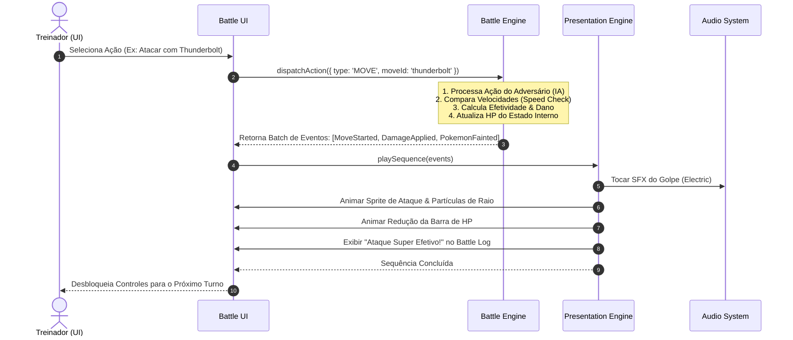

# ⚔️ Arquitetura Técnica: Pokémon Battle Arena

Documento de especificação arquitetural para a evolução do projeto **Pokédex Pro** (desafio DIO) para a plataforma integrada **Pokédex Pro + Pokémon Battle Arena**.

---

## 1. Objetivo Geral

O objetivo deste projeto é expandir a Pokédex existente — construída com **HTML5**, **CSS3** e **JavaScript Vanilla** consumindo a **PokéAPI REST** — transformando-a em uma aplicação de portfólio robusta e completa, contendo:

1. **Pokédex Completa** (preservada e otimizada);
2. **Team Builder** (gerenciamento e persistência de equipes táticas de 1 a 6 Pokémon);
3. **Pokémon Battle Arena** (simulador de batalhas por turnos 1x1 e 3x3 contra inteligência artificial, cálculo de dano fiel às mecânicas clássicas, efetividade de tipos, sistema de movimentos, animações dinâmicas e efeitos visuais/sonoros).

A evolução ocorre de maneira **incremental e orientada a fases (PBA-001 a PBA-018)**, garantindo que o código existente nunca seja quebrado e que novas funcionalidades sejam introduzidas com separação estrita de responsabilidades.

---

## 2. Princípios Arquiteturais Fundamentais

1. **Preservação da Pokédex Atual**: Nenhuma refatoração deve introduzir regressões na listagem, busca, paginação, filtros, modal ou reprodução de áudio já existentes.
2. **Regra de Ouro: Game Engine ≠ Presentation Engine**: A lógica matemática e as regras de combate nunca dependem de elementos visuais, classes CSS, APIs de áudio ou manipulação de DOM.
3. **Pureza do Modelo de Domínio**: Entidades do jogo (`Pokemon`, `Move`, `Team`, `Trainer`) contêm dados e regras de negócio puras, operando independentemente de bibliotecas externas e da PokéAPI.
4. **Isolamento de Estado (Game State)**: O estado da batalha é serializável, determinístico e desacoplado da interface gráfica.
5. **Zero Dependências Pesadas / Vanilla First**: O projeto demonstra proficiência técnica em JavaScript Vanilla, arquitetura limpa, manipulação avançada de DOM e CSS moderno.
6. **Acessibilidade e Desempenho**: Suporte futuro a `prefers-reduced-motion`, controle de volume independente, contrastes adequados e carregamento sob demanda (*lazy loading*).

---

## 3. Separação em Camadas

A arquitetura do projeto adota uma estrutura em camadas unidirecional:

```text
       ┌───────────────────────────────┐
       │          Data / API           │  (poke-api.js / PokemonRepository)
       └──────────────┬────────────────┘
                      │ DTOs / JSON transformados
                      ▼
       ┌───────────────────────────────┐
       │         Domain Model          │  (Pokemon, Move, Team, Trainer)
       └──────────────┬────────────────┘
                      │ Entidades e atributos puros
                      ▼
       ┌───────────────────────────────┐
       │          Game Engine          │  (BattleEngine, TurnManager, DamageCalc)
       └──────────────┬────────────────┘
                      │ Eventos de Batalha (Action Events)
                      ▼
       ┌───────────────────────────────┐
       │      Presentation Engine      │  (AnimationQueue, AudioSystem, VFX)
       └──────────────┬────────────────┘
                      │ Atualizações Visuais / Áudio
                      ▼
       ┌───────────────────────────────┐
       │           UI / DOM            │  (Telas, Painéis, Healthbars, Modais)
       └───────────────────────────────┘
```

---

## 4. O Paradigma "Game Engine ≠ Presentation Engine"

Esta é a diretriz mais crítica para o desenvolvimento da Battle Arena.

### Battle Engine (Lógica Pura)
Responsável por:
- Determinar a iniciativa de ataque com base em *Speed* e prioridade do movimento;
- Calcular precisão (*accuracy*) e taxa de acerto crítico (*critical hit*);
- Calcular o dano real através da fórmula padrão considerando ataque, defesa, STAB (*Same-Type Attack Bonus*) e tabela de tipos;
- Gerenciar a fila de turnos e status de combate (*fainted*, trocas, turnos decorridos);
- Executar a tomada de decisão da IA adversária;
- Emitir uma sequência determinística de **Eventos de Ação** (*Action Events*).

### Presentation Engine (Efeitos, Som e Visuais)
Responsável por:
- Consumir os *Action Events* emitidos pela Battle Engine de forma assíncrona;
- Reproduzir animações de sprites (entrada, ataque corporal, projéteis, impacto, recuo);
- Sincronizar efeitos sonoros (*cry* do Pokémon, som de golpe, impacto, vitória/derrota);
- Controlar animações de barras de HP e feedback numérico de dano;
- Disparar efeitos visuais (tremores de tela / *shake*, flashes, partículas de fogo, água, eletricidade);
- Notificar a UI quando a apresentação do turno foi finalizada, liberando o próximo comando do jogador.

> **Importante**: Se a camada de apresentação for desativada (por exemplo, em testes automatizados ou em modo de simulação rápida), a batalha pode ser executada instantaneamente em milissegundos sem qualquer erro ou dependência gráfica.

---

## 5. Fluxo Futuro de uma Batalha



---

## 6. Responsabilidades dos Módulos Detalhados

| Módulo | Camada | Responsabilidade Técnica |
| :--- | :--- | :--- |
| `poke-api.js` | Data | Requisições HTTP com Fetch API para a PokéAPI REST, conversão de payloads brutos em instâncias do modelo. |
| `PokemonRepository` | Data | Gerenciamento de cache em memória e LocalStorage, reduzindo chamadas repetidas à rede. |
| `Pokemon` | Domain | Representação de atributos base (*hp, attack, defense, spAttack, spDefense, speed*), tipos, habilidades e dados de espécie. |
| `Move` | Domain | Representação de golpes: tipo, categoria (*physical, special, status*), poder (*power*), precisão (*accuracy*) e PP. |
| `TypeChart` | Domain | Matriz bidimensional de relações elementais (fraquezas 2x, resistências 0.5x e imunidades 0x). |
| `Team` | Domain | Estrutura de equipe (1 a 6 integrantes), validações de tamanho, Pokémon ativo e reservas. |
| `BattleEngine` | Engine | Controlador central da lógica de batalha, turnos, condições de vitória/derrota. |
| `DamageCalculator` | Engine | Implementação matemática da fórmula de dano dos jogos da franquia, aplicando modificadores. |
| `BattleAI` | Engine | Heurística adversária (seleção de movimentos por efetividade, trocas inteligentes). |
| `BattlePresentation` | Presentation | Orquestrador da fila de animações e transições entre estados gráficos. |
| `AudioSystem` | Presentation | Gerenciador de canais de áudio com canais separados (Música de Fundo, SFX de Ataque, Cry, Interface) e controle de volume. |
| `AnimationSystem` | Presentation | Execução de animações CSS/Canvas de movimentos de sprites e partículas elementais. |
| `BattleUI` | UI | Painéis de comando, caixas de diálogo (*Battle Log*), seletores de golpe e barras de status. |

---

## 7. Decisões Técnicas das Fases

### Fase PBA-001 (Foundation)
1. **Manutenção dos Scripts Globais Sem Quebra**: Os arquivos existentes (`pokemon-model.js`, `poke-api.js`, `main.js`) foram mantidos compatíveis com carregamento direto sem empacotadores, viabilizando execução direta no GitHub Pages e no protocolo local `file://`.
2. **Navegação Não-Destrutiva**: Introdução das abas de navegação no cabeçalho (`Pokédex`, `Meu Time`, `Batalhar`).
3. **Estrutura de Armazenamento com Namespaces**: Preservação de `pokedex_favorites` e `pokedex_theme`.

### Fase PBA-002 (Team Builder)
1. **Modelo do Time**: Capacidade máxima de 3 Pokémon (`TEAM_MAX_SIZE = 3`), proibição estrita de duplicatas (`DUPLICATE_POKEMON = FORBIDDEN`) e preservação da ordem (`ORDER_MATTERS = YES`), onde o **Slot 1** define o Líder (*Lead*) que iniciará futuras batalhas.
2. **Persistência Estruturada (`team.current`)**: Armazenamento serializado contendo apenas IDs essenciais (`{ "version": 1, "pokemonIds": [25, 6, 94] }`), com sanitização automática contra JSON corrompido, IDs inválidos ou arrays fora dos limites.
3. **Desacoplamento Modular**: Separação em três componentes especializados em `assets/js/team/`:
   - `TeamStore`: Manipulação e validação do `localStorage`;
   - `TeamManager`: Regras de negócio, reordenação e emissão de eventos;
   - `TeamUI`: Renderização dos slots (ocupados, vazios e erro), feedback dinâmico e botões de atalho.
4. **Sincronização em Tempo Real**: Atualização instantânea dos cards da Pokédex (`✓ No time`), botões do modal e contadores do cabeçalho sem necessidade de recarregamento.

### Fase PBA-003 (Battle Engine v1)
1. **Núcleo Matemático Isolado e Desacoplado**:
   - Criação dos módulos em `assets/js/battle/`:
     - `battle-constants.js`: Estados (`BATTLE_STATUS`), eventos (`BATTLE_EVENTS`), ações (`BATTLE_ACTIONS`) e configurações (`BATTLE_CONFIG`);
     - `damage-calculator.js`: Cálculo de dano determinístico baseado estritamente em Ataque e Defesa;
     - `turn-manager.js`: Gerenciador de iniciativa baseado em Velocidade (*Speed*);
     - `battle-engine.js`: Criação do estado de combate, normalização de combatentes, validações contra estados inválidos/NaN, resolução de turnos e emissão de eventos ordenados.
2. **Modelo do Combatente Normalizado**:
   - Estrutura pura e independente da PokéAPI ou do DOM:
     ```json
     {
       "id": 4,
       "name": "charmander",
       "maxHp": 39,
       "currentHp": 39,
       "attack": 52,
       "defense": 43,
       "speed": 65
     }
     ```
   - Validação estrita: rejeita `id <= 0`, `name` vazio, `hp <= 0`, `attack <= 0`, `defense <= 0`, `speed < 0`, `NaN`, `Infinity`, `null` ou `undefined`.
3. **Estado de Batalha v1 (Battle State)**:
   - Serializável, determinístico e imutável nas entradas:
     ```json
     {
       "version": 1,
       "status": "IN_PROGRESS",
       "turn": 1,
       "player": { "id": 4, "name": "charmander", "maxHp": 39, "currentHp": 39, "attack": 52, "defense": 43, "speed": 65 },
       "enemy": { "id": 1, "name": "bulbasaur", "maxHp": 45, "currentHp": 45, "attack": 49, "defense": 49, "speed": 45 },
       "winner": null
     }
     ```
   - Estados: `READY`, `IN_PROGRESS`, `PLAYER_WIN`, `ENEMY_WIN`.
4. **Fórmula de Dano da PBA-003**:
   - Inspirada na estrutura clássica da franquia, porém estritamente determinística (sem randomização, sem fraquezas/resistências de tipo e sem acertos críticos):
     ```text
     SIMULATION_LEVEL = 50
     BASIC_ATTACK_POWER = 40
     
     damage = floor(((((2 * SIMULATION_LEVEL / 5) + 2) * BASIC_ATTACK_POWER * attack / defense) / 50) + 2)
     damage = max(1, damage)
     ```
   - Piso de HP: o dano recebido nunca deixa o combatente com HP negativo (`currentHp = max(0, previousHp - damage)`).
5. **Regra de Iniciativa e Desempate**:
   - O combatente com maior *Speed* atua primeiro;
   - Em caso de empate de *Speed*, aplica-se a regra determinística da fase: `PLAYER_FIRST_ON_SPEED_TIE = true` (jogador sempre atua primeiro no desempate da PBA-003).
6. **Fluxo do Turno e Suspensão de Contra-Ataque**:
   - Turno inicia -> Ordem definida -> 1º Pokémon ataca -> Dano aplicado -> Verificação de nocaute (`currentHp === 0`).
   - Se o primeiro combatente nocautear o alvo: o combate encerra imediatamente (`POKEMON_FAINTED` e `BATTLE_ENDED`), status atualizado para vitória/derrota, e o Pokémon derrotado **NÃO contra-ataca**.
   - Bloqueio pós-combate: tentativas de invocar `resolveTurn()` em batalha já encerrada são rejeitadas com erro controlado, sem corromper o estado.
7. **Barramento de Eventos Estruturados**:
   - Eventos emitidos em sequência ordenada:
     - `BATTLE_STARTED`
     - `TURN_STARTED` (com número do turno)
     - `ACTION_STARTED` (com ator e ação executada)
     - `DAMAGE_APPLIED` (com fonte, alvo, dano numérico, HP anterior e HP resultante)
     - `POKEMON_FAINTED` (com alvo derrotado)
     - `BATTLE_ENDED` (com vencedor e causa)
8. **Critérios de Isolamento Absoluto**:
   - `BATTLE_ENGINE_DOM_DEPENDENCIES = 0` (nenhum `document.*` ou `window.*` de interface);
   - `BATTLE_ENGINE_FETCH_CALLS = 0` (sem chamadas à PokéAPI durante a simulação);
   - `BATTLE_ENGINE_LOCALSTORAGE_DEPENDENCIES = 0` (sem persistência acoplada);
   - `BATTLE_ENGINE_AUDIO_DEPENDENCIES = 0` (sem dependências sonoras);
   - `INPUT_MUTATION = NONE` (entradas são clonadas e imutáveis).

---

## 8. Decisões Explicitamente Adiadas

- **Sistema de Tipos e Efetividade (Fraquezas / Resistências / Imunidades)**: Reservado integralmente para a Fase PBA-004.
- **Sistema de Golpes Reais, PP, Acurácia e Crítico**: Reservado para a Fase PBA-005.
- **Batalhas 3x3 e Trocas de Pokémon**: Reservado para a Fase PBA-006.
- **Inteligência Artificial Estratégica**: Reservada para a Fase PBA-007.
- **Camada Visual e Sonora da Arena**: Reservada para as fases PBA-008 a PBA-013.

---

## 9. Riscos Técnicos e Estratégias de Mitigação

1. **Rate Limiting da PokéAPI**:
   - *Risco*: Múltiplas requisições simultâneas para carregar dados de golpes de vários Pokémon durante a batalha podem saturar a API ou atrasar o início do combate.
   - *Mitigação*: Armazenar golpes comuns em um dicionário estático local e carregar dados sob demanda com cache em memória (*PokemonRepository*).
2. **Políticas de Autoplay de Áudio nos Navegadores**:
   - *Risco*: Navegadores modernos bloqueiam reprodução automática de áudio sem interação prévia do usuário.
   - *Mitigação*: Inicializar o contexto de áudio somente após o primeiro clique do usuário (ex: botão "Batalhar" ou clique nos controles).
3. **Direitos Autorais e Licenciamento de Assets**:
   - *Risco*: Utilizar músicas ou efeitos sonoros proprietários da Nintendo/Game Freak.
   - *Mitigação*: Usar efeitos de domínio público ou licença aberta (CC0 / OpenGameArt / som gerado via Web Audio API) para a arena de batalha, mantendo apenas os *cries* públicos disponibilizados pela própria PokéAPI.
4. **Performance com Múltiplas Animações e Sprites**:
   - *Risco*: Queda de framerate em dispositivos móveis menos potentes.
   - *Mitigação*: Uso de transformações CSS aceleradas por hardware (`transform: translate3d`, `opacity`), desativação de partículas quando detectado `prefers-reduced-motion`.

---

## 10. Roadmap Técnico Oficial

```text
[x] PBA-001 Foundation (Preparação e Arquitetura) ──────────── [CONCLUÍDA]
[x] PBA-002 Team Builder (Montagem e Persistência de Equipe) ── [CONCLUÍDA]
[x] PBA-003 Battle Engine v1 (Estrutura Básica de Combate 1x1) ─ [CONCLUÍDA]
[ ] PBA-004 Type System (Tabela Completa de Tipos e Efetividades)
[ ] PBA-005 Move System (Sistemas de Golpes, Categorias e PP)
[ ] PBA-006 Battle 3x3 (Batalha em Equipe com Trocas de Pokémon)
[ ] PBA-007 Battle AI (Algoritmos e Heurísticas de Adversários)
[ ] PBA-008 Battle Presentation Engine (Desacoplamento Visual da Lógica)
[ ] PBA-009 Pokemon Animations (Sprites Animados e Movimentos Corporais)
[ ] PBA-010 Move Visual Effects (Partículas de Fogo, Água, Trovão, etc.)
[ ] PBA-011 Audio System (Músicas de Fundo, Golpes e Controles de Som)
[ ] PBA-012 Battle Camera & Impact (Screen Shake, Zooms e Críticos)
[ ] PBA-013 Final Battle UI (Interface Polida e Responsiva de Combate)
[ ] PBA-014 Trainer Profile (Estatísticas, Histórico e Insígnias)
[ ] PBA-015 Campaign Mode (Trilha de Desafios e Líderes de Ginásio)
[ ] PBA-016 Performance & Accessibility (Otimizações Finais)
[ ] PBA-017 Automated Tests (Testes de Regras, Cálculos e Efetividade)
[ ] PBA-018 Portfolio Release (Deploy Final e Documentação de Caso de Estudo)
```
